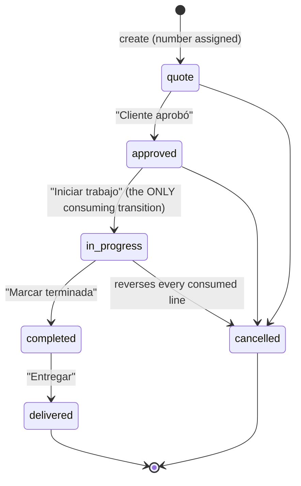
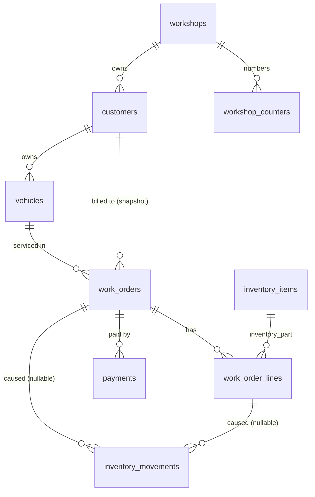
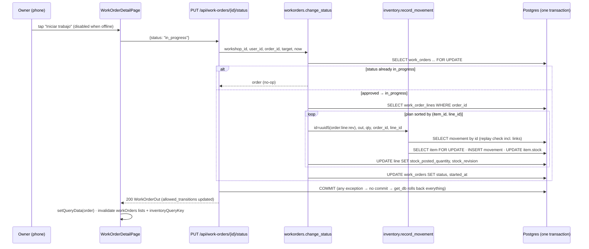
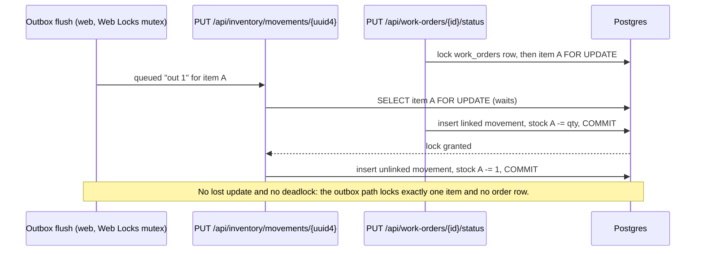
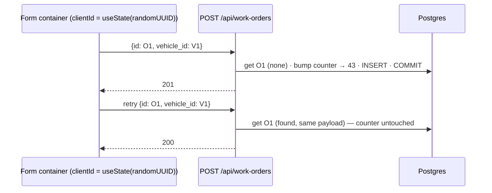
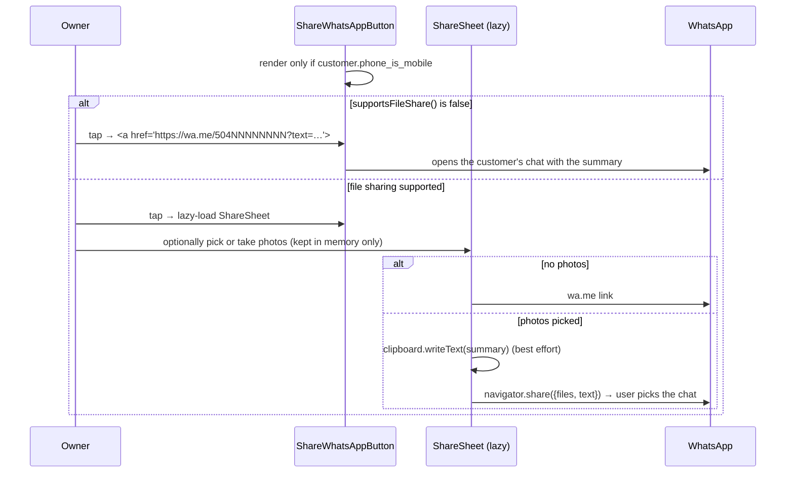
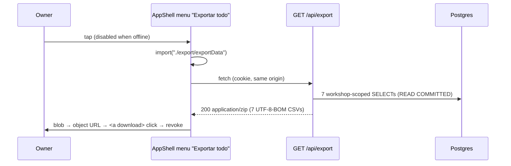

# Design: Workshop core (customers and vehicles, work orders with WhatsApp sharing, payments and export)

Change: `workshop-core` · Inputs: `proposal.md` (its "Product Decisions" section is final), `exploration.md`, the ten capability specs under `specs/`, and the coordinator's correction that the customer phone reuses identity's `PhoneNumber` unchanged.

## Technical Approach

Three phases, each a vertical slice through the API (new hexagonal feature packages), the web (new feature folders under a new app shell) and the demo seed. The design follows the existing patterns and does not introduce new frameworks or runtime dependencies.

- **API packages.** `taller/customers/` (phase 1) holds customers and vehicles. `taller/workorders/` (phase 2) holds orders, lines, the per-workshop counter, stock consumption and, in phase 3, payments and the daily cash summary. `taller/export/` (phase 3) is a read-only adapter module that builds the ZIP.
- **Inventory ledger.** The ledger changes only in phase 2's first slice, and only in three ways:
  - two nullable link columns on `inventory_movements`;
  - replay matching in `record_movement` that takes the link into account;
  - an item-history projection that carries the order number.
- **Stock consumption.** Every inventory-part line's *posted quantity* is reconciled toward a *target* that depends only on the order status and the line's own state. The single stock-consuming transition, quantity edits, line removal and cancellation all reduce to that one rule. Each posting goes through inventory's existing `record_movement` with a deterministic `uuid5` id.
- **Web.** A layout route renders `AppShell` (header, bottom nav, `<Outlet/>`) inside `RequireSession`. Each new feature follows the inventory shape: `api.ts`, `copy.ts` and `hooks.ts`, plus containers and presentational components. Writes are online-only. Reads come from the persisted cache under `workshopQueryKey`-prefixed keys. Print, share and cash-summary code loads lazily.

## Codebase facts this design builds on

Verified in this session:

| Fact | Where |
|---|---|
| `record_movement(*, workshop_id, movement_id, item_id, kind, quantity, note, occurred_at, created_by, item_repo, movement_repo) -> (movement, item, is_new)`. It checks replay first (`_movement_matches` on `{item_id, kind, quantity, note}`), then locks the item with `get_for_update`. It never blocks negative stock. | `api/src/taller/inventory/application/use_cases.py:296-372` |
| Deterministic-id idiom: `_initial_movement_id = uuid5(_INITIAL_STOCK_NAMESPACE, str(item_id))` | `use_cases.py:29-36` |
| Item create is `POST /api/inventory/items` with an optional client `id`: 201 when new, 200 on replay, 409 `item_id_conflict` on conflict. Updates are `PATCH`. Archive is `POST .../{id}/archive`, which returns 204. Listing takes `include_archived`. Bounds: `sale_price_cents ≤ 1_000_000_000`, `min_stock` and `initial_stock ≤ 1_000_000`. | `api/tests/inventory/test_items_api.py:46-345` |
| `PUT /api/inventory/movements/{movement_id}` accepts **any** client-chosen id, including one derived with `uuid5` (the test records a movement at `_initial_movement_id`). | `test_items_api.py:327-331` |
| Money is stored as integer cents (`sale_price_cents`). | `inventory-mvp-rebuild.md` "Decisions"; `test_items_api.py` |
| Constraint names are Postgres defaults (`inventory_items_workshop_id_fkey`, `<table>_pkey`). Routes map `IntegrityError` by constraint name and retry a concurrent-insert race once. | `test_items_api.py:229`; `inventory/adapters/router.py:45-47`; T3 decisions |
| `PhoneNumber` accepts first digits `"23456789"`, so landlines starting with 2 already pass. | `api/src/taller/identity/domain/phone_number.py:16` |
| `workshopQueryKey(workshopId)` is exported. `inventoryQueryKey` and `useWorkshopId` are module-private. | `web/src/features/auth/hooks.ts:18`; `web/src/features/inventory/hooks.ts:25,48` |
| `useOnlineStatus()` returns **true while offline**. | `web/src/shared/offline/useOnlineStatus.ts:33-36` |
| `RequireSession` renders `OfflineStatusBanner` followed by its children. `router.tsx` nests the four inventory pages under `/inventario`. | `web/src/app/RequireSession.tsx:46-52`; `web/src/app/router.tsx` |
| The MSW default handlers list is deliberately empty; every test adds its own handlers with `server.use(...)`. | `web/src/test/handlers.ts` |
| The service worker answers `/api/*` `NetworkOnly`. `vite-plugin-pwa` uses the default precache globs. | `web/vite.config.ts:59-78` |
| `alembic check` runs as a test. | `api/tests/test_migrations.py` |
| The seed derives ids with `uuidgen --sha1 --namespace @url --name "taller-mecanico/demo-seed/<key>"` and treats 201, 200 and 409 as normal outcomes. | `deploy/demo/seed-demo-account.sh` |

Corrections to claims in the proposal (non-blocking; the specs owner may align wording):

1. **Money.** The proposal says `numeric(12,2)`, but the codebase stores integer cents. This design uses integer cents everywhere (AD-10).
2. **Customer phone.** The proposal says `PhoneNumber` rejects landlines. It does not (see the table above), so the customer phone reuses `PhoneNumber` unchanged, per the coordinator's correction (AD-8).
3. **MSW handlers.** The proposal says "one handler per new endpoint in `handlers.ts`". The real pattern is a `server.use` per test, and `handlers.ts` stays empty.
4. **Lazy loading.** The proposal says lazy loading "keeps the PWA precache lean". Lazy chunks are still precached by the default Workbox globs. The gain is a smaller main chunk to parse and execute at startup, not fewer precached bytes (AD-16).
5. **58 mm page size.** `@page { size: 58mm auto }` is invalid CSS: `size` takes one or two lengths, and `auto` cannot be combined with a length, so browsers drop the declaration. See AD-19.
6. **Order counter SQL.** The proposal's counter `UPDATE … RETURNING` becomes an `INSERT … ON CONFLICT DO UPDATE … RETURNING` upsert, so no counter row has to be created when a workshop registers (AD-6).

Not readable in this session (a tooling gap: the read hooks blocked these files). The design names the behavior, and the first task of each slice confirms the identifier before writing code:

- where `get_clock` is defined;
- whether identity already has an error code for an invalid phone;
- how `migrations/env.py` imports models, and the shape of `MIGRATION_ONLY_INDEXES`;
- the HTTP codes inventory uses for `MovementIdConflict` and `StockOutOfRange`;
- the name of the workshops table;
- where the lempira `format.ts` lives;
- the `networkMode` of the item create/edit mutations;
- how the existing login-throttle and stock concurrency tests open committed connections.

## Architecture Decisions

### AD-1: Feature packages and dependency directions

**Choice.** The new packages are `taller/customers`, `taller/workorders` (which also takes payments and the cash summary in phase 3) and `taller/export`. The dependency arrows are:

```
customers.domain ─────────────► identity.domain.PhoneNumber            (value object reuse)
workorders.application ───────► inventory.application                  (record_movement, get_item)   AD-2
workorders.application ───────► customers.application                  (vehicle + owner lookups)     AD-12
workorders.adapters.router ───► inventory/customers adapters.repositories (composition root only)
inventory.adapters.repositories ─► "work_orders" table by name          (history order number)      AD-12
export.adapters ──────────────► customers/inventory/workorders models   (read-only selects)          AD-13
every router ─────────────────► identity.adapters.dependencies          (existing pattern)
```

Python imports never form a cycle. Inventory refers to the work-order tables only by table-name strings (`ForeignKey("work_orders.id")`, `sqlalchemy.table("work_orders", ...)`), never through a module import.

**Alternatives considered.**
- A separate `taller/payments` feature. Rejected because it creates a two-way dependency: payments needs the order total, and cancelling an order needs to know whether payments exist.
- Per-feature "export ports" added to every repository. Rejected because it spreads a serialization concern across four features.

**Rationale.**
- Every application-to-application arrow points from the newer, higher-level feature to the older one.
- The only reverse reference (inventory to `work_orders`) is schema-level and already implied by the foreign keys that the spec requires on `inventory_movements`.

### AD-2: Work orders call inventory's `record_movement` directly (accepted cross-feature dependency)

**Choice.**
- `taller.workorders.application.use_cases` imports `record_movement` and `get_item` from `taller.inventory.application.use_cases`, and the `ItemRepository` and `MovementRepository` port types from `taller.inventory.application.ports`.
- The work-orders router, as the composition root, builds `SqlAlchemyItemRepository(db)` and `SqlAlchemyMovementRepository(db)` on the same request session and passes them through.
- Work orders never import inventory's models, never issue SQL against inventory tables, and never touch `Item.stock`.

This is the codebase's first application-to-application dependency between features, and it is accepted here explicitly.

**Alternatives considered.**
1. A `StockLedger` port owned by work orders, with an adapter that wraps `record_movement`. Rejected: it adds an indirection layer and a second set of fakes, for a monolith in which both features share one transaction and one session.
2. Work orders writing `inventory_movements` and `inventory_items` themselves. Rejected: it duplicates the lock, the delta and the overflow logic, which breaks "stock is only ever changed by `record_movement`".
3. Posting through the HTTP movement endpoint or the outbox. Rejected: the order's status change and its movements must commit in one transaction (spec requirement).

**Rationale.**
- `record_movement` already holds every ledger invariant: the row lock, the delta computation, the out-of-range guard and idempotent replay. Reusing it keeps one way to change stock.
- The call shares the caller's transaction, so the status write and every movement commit or roll back together.

### AD-3: Order links take part in replay matching

**Choice.**
- `record_movement` gains `order_id: uuid.UUID | None = None` and `order_line_id: uuid.UUID | None = None` as trailing keyword-only parameters.
- `StockMovement` gains both fields with `None` defaults.
- `_movement_matches` compares `{item_id, kind, quantity, note, order_id, order_line_id}`.
- The HTTP movement request schema does **not** accept the link fields. Only the work-orders use cases can set them.

**Alternatives considered.** Treating the links as metadata outside the comparison. Rejected because of a real attack path. `PUT /api/inventory/movements/{id}` accepts any id (`test_items_api.py:327`), and `uuid5` ids are derivable. A client could therefore pre-record an unlinked movement at an order line's future id with the same `{item_id, kind, quantity, note}`. With links excluded from the comparison, the order's consumption would be taken as a "replay" and silently skipped.

**Rationale.**
- Outbox movements carry `None/None` on both the original and the replay, so their comparison result does not change. The existing outbox tests and the "offline-queued movement replay is unaffected" spec scenario still hold.
- A movement planted at a derived id now surfaces as a conflict (409, using inventory's existing `MovementIdConflict` code) and rolls back the transition, instead of corrupting stock silently.
- Cross-tenant planting is not feasible, because order and line ids are random client UUIDs that are never shown to another workshop.

### AD-4: Stock consumption is per-line reconciliation with persisted posting state

**Choice.** Each `work_order_lines` row carries `stock_posted_quantity` (the net units this line has taken out of stock) and `stock_revision` (how many movements it has posted). Every use case that changes an order's status or its lines finishes by running one function:

```
target(line, status) = line.quantity   if line.kind == "inventory_part"
                                        and line.removed_at is None
                                        and status in CONSUMING
                       0               otherwise

for each line where target != posted, sorted by (item_id, line_id):
    diff     = target - posted
    revision = line.stock_revision + 1
    record_movement(id    = uuid5(WORK_ORDER_STOCK_NAMESPACE, f"{order_id}:{line_id}:{revision}"),
                    kind  = "out" if diff > 0 else "in", quantity = abs(diff), note = None,
                    order_id = order_id, order_line_id = line_id, ...)
    line.stock_posted_quantity = target; line.stock_revision = revision
```

Invariant at every commit: `stock_posted_quantity == target(line, order.status) == -SUM(delta)` over that line's linked movements.

| Event | posted → target | Movement posted |
|---|---|---|
| `approved → in_progress` | 0 → qty | `out qty` (revision 1) |
| Inventory line added while consuming | 0 → qty | `out qty` |
| Quantity 2 → 5 while consuming | 2 → 5 | `out 3` |
| Quantity 5 → 2 while consuming | 5 → 2 | `in 3` |
| Line removed while consuming | qty → 0 | `in qty` |
| `in_progress → cancelled` | qty → 0, for every line | `in qty` per line |
| Any edit in `quote` or `approved` | 0 → 0 | none |
| `in_progress → completed`, `completed → delivered` | qty → qty | none |

**Alternatives considered.**
1. Separate code paths with event-tagged ids (`:consume`, `:edit:{n}`, `:reversal`). Rejected: four code paths, and "cancel after two edits" and "remove after an edit" need special cases.
2. Deriving the posted quantity from the ledger (`-SUM(delta) WHERE order_line_id = …`) instead of persisting it. Rejected: work orders would need a new inventory read port, while the persisted columns keep the aggregate self-contained. The invariant is asserted in tests instead.

**Rationale.**
- One rule covers consumption, deltas, removal and reversal.
- A replayed request finds `target == posted` and posts nothing.
- The revision number is the deterministic "event identity" that the spec asks for: revision 1 is the initial consumption, and later revisions are numbered edits or the reversal.

### AD-5: Lock order (deadlock freedom)

**Choice.** One global order of lock acquisition:

1. The `work_orders` row (`SELECT … FOR UPDATE`). Every mutating work-order use case starts here; this also serializes line edits against status changes.
2. `inventory_items` rows in ascending `(item_id, line_id)` order, taken by `record_movement`'s `get_for_update` as the reconciliation loop walks the sorted plan.
3. The `workshop_counters` row, taken only by order creation, which locks no items.

The outbox's `PUT /movements/{id}` locks exactly one item and nothing else, so it cannot close a cycle. Two orders touching items `{A, B}` and `{B, A}` both lock A before B: one waits, neither deadlocks.

**Alternatives considered.**
- Locking items in line order. Rejected: this is the deadlock the spec forbids.
- Pre-locking with `SELECT … ORDER BY id FOR UPDATE`. Rejected: Postgres does not promise lock order to match `ORDER BY` in every plan, and it duplicates `record_movement`'s own lock.

**Rationale.** Deterministic ordering is the standard prevention. It is enforced in one pure function (`plan_reconciliation`) that a unit test checks, and a two-thread concurrency test proves it end to end.

### AD-6: Order numbers from an upsert in the create transaction; replay detection comes first

**Choice.**

```sql
INSERT INTO workshop_counters (workshop_id, name, value)
VALUES (:workshop_id, 'work_order', 1)
ON CONFLICT (workshop_id, name) DO UPDATE SET value = workshop_counters.value + 1
RETURNING value;
```

`create_work_order` runs these steps in order:

1. Look up the order id, scoped by workshop. If it exists, compare the payload and return 200, or raise `WorkOrderIdConflict`. **The counter is not touched.**
2. Resolve the active vehicle through the customers application, or return 404 `vehicle_not_found`.
3. Bump the counter. This is the last read before the insert, which keeps the row-lock hold time short.
4. Insert the order and flush. The route commits once.

On an `IntegrityError` naming `work_orders_pkey` (two concurrent creates with the same id), the route rolls back, which **also undoes the counter bump**. It then retries the use case once, and step 1 now finds the row. If the retry fails the same way (a cross-tenant id collision, as handled in T3b), it answers 409 `work_order_id_conflict`.

**Alternatives considered.**
- Per-workshop `SEQUENCE` objects. Rejected in the proposal.
- A plain `UPDATE … RETURNING` on a row created at registration. Rejected: it would change identity's register use case and need a backfill for existing workshops.
- `MAX(number) + 1`. Rejected: it races.

**Rationale.**
- A single statement takes the row lock implicitly.
- Rolling back on any failure keeps numbers gapless.
- Running replay detection before the bump guarantees that a retried create never consumes a second number.
- `UNIQUE (workshop_id, number)` is the last line of defense.

### AD-7: Status changes are idempotent `PUT`s of a target status over an acyclic machine

**Choice.** `PUT /api/work-orders/{id}/status` with `{"status": "<target>"}`:

- If `current == target`, the response is 200 with the order unchanged (a no-op).
- If `target` is in `TRANSITIONS[current]`, the transition is applied and the response is 200.
- Otherwise the response is 409 `invalid_status_transition`.

The machine has no back edges (see "Work-order status state machine" below).

**Alternatives considered.**
- `POST /transitions` with a `from/to` compare-and-set. Rejected: unnecessary on an acyclic machine.
- Allowing reopen (`completed → in_progress`). Rejected: a back edge would let a stale retry re-enter a state.

**Rationale.**
- Because no state can be re-entered, a stale or duplicate request for "→ X" is either a no-op (the order is already at X) or a 409 (the order has moved past X). It can never cause a second entry into X, and therefore never a second consumption.
- The response carries `allowed_transitions`, so the web never duplicates the transition table.

### AD-8: The customer phone reuses identity's `PhoneNumber`; `is_mobile` is derived, not stored

**Choice.**
- `customers.domain` calls `PhoneNumber.from_raw(raw)` unchanged when a phone is present, and stores only its normalized 8 digits in `customers.phone` (nullable).
- `Customer.phone_is_mobile` is a property: `None` without a phone, otherwise `phone[0] != "2"`. Responses expose it, and it gates WhatsApp sharing.
- The use case maps `InvalidPhoneNumber` to HTTP 422 `invalid_phone`. If identity already maps an invalid phone to a code, that code is reused, so the web keeps one Spanish message.
- Login rules are untouched.

**Alternatives considered.**
- A customers-specific value object accepting 2/3/7/8/9. Superseded by the coordinator's correction.
- Storing a `phone_is_mobile` column. Rejected: it duplicates data that can be derived, and could drift if a numbering-plan change ever reclassifies prefixes. The spec's "record whether the number is a mobile" is met by the response field.

**Rationale.** This keeps a single normalization rule. The only new dependency is domain to domain on a pure value object, which is acceptable.

### AD-9: Plates are normalized in Python and unique per workshop through a partial index on the model

**Choice.**
- `normalize_plate(raw)`: strip, uppercase, then remove whitespace and `-`, `.` and `/`. An empty result means no plate (`None`). The result must match `^[A-Z0-9]{1,12}$`, or the request gets 422 `invalid_plate`. Only the normalized form is stored.
- The model declares `Index("uq_vehicles_workshop_plate_active", "workshop_id", "plate", unique=True, postgresql_where=text("archived_at IS NULL AND plate IS NOT NULL"))`.
- A pre-check returns 409 `plate_taken`. The route also maps an `IntegrityError` that names that index to `plate_taken`, for the race. Any other integrity error re-raises, the same discipline T9b applied to item renames.

**Alternatives considered.** An `IMMUTABLE` normalization function in SQL plus a functional index. Rejected: it would need a `MIGRATION_ONLY_INDEXES` entry, and a plate has no display formatting worth keeping.

**Rationale.** Normalizing in Python mirrors `PhoneNumber`'s normalize-and-discard idiom, and the index stays expressible on the model.

### AD-10: Money is integer cents; totals are computed, not cached

**Choice.**
- `unit_price_cents INTEGER` (0 to 1,000,000,000, the same bound as `sale_price_cents`).
- `quantity INTEGER` (1 to 10,000).
- `payments.amount_cents BIGINT`.
- A line subtotal is `quantity * unit_price_cents`, computed in Python, or in SQL as `SUM(quantity::bigint * unit_price_cents)`. An `int4 * int4` product would overflow before the `SUM` widens it.
- The order total is the sum over lines that are not removed. Paid and balance follow in phase 3.
- No tax fields anywhere (product decision 2).

**Alternatives considered.**
- `numeric(12,2)` as in the proposal. Rejected: the codebase convention is cents.
- A cached `total_cents` on the order, like `Item.stock`. Rejected: shop volumes are tiny, and a cache needs drift tests.

**Rationale.** This is consistent with `sale_price_cents` and leaves no floating-point arithmetic anywhere.

### AD-11: Payments belong to the work-order aggregate

**Choice.**
- The `payments` table, the `record_payment` use case and the cash summary live in `taller/workorders/` (phase 3).
- `record_payment` locks the order row, runs replay detection **first**, and only then checks that the status allows payments and the balance.
- Cancelling an order that has payments returns 409 `work_order_has_payments`.

**Alternatives considered.** A separate feature (see AD-1).

**Rationale.**
- The balance (total minus paid) and the cancellation guard are invariants of the order aggregate.
- The order row lock serializes payments against line edits and status changes, so two concurrent payments cannot overpay.

### AD-12: Composing read models across features

**Choice.**
- **Order responses** embed the vehicle and its owner. Work orders call two customers application functions:
  - `get_active_vehicle(workshop_id, vehicle_id)` when creating an order;
  - `describe_vehicles(workshop_id, vehicle_ids)`, which batches one query per table, for lists and details.
  There is no SQL join across features.
- **Item history** gains `order_id`, `order_line_id` and `order_number`. Inventory's movement repository `LEFT JOIN`s `work_orders` through a lightweight `sqlalchemy.table("work_orders", column("id"), column("number"))` construct and returns a new `MovementHistoryEntry(movement, order_number)` read model.
- `work_orders.customer_id` is snapshotted from the vehicle at creation. Vehicles cannot change owner in this change, so it serves as a filter index for "a customer's orders".

**Alternatives considered.**
- Snapshotting the customer's name and phone on the order. Rejected: a corrected phone must take effect for WhatsApp sharing.
- Having the web resolve order numbers with one extra request per history page. Rejected: more client complexity and a worse offline experience.
- Putting `order_number` on `StockMovement`. Rejected: it mixes a read projection into the write entity.

**Rationale.** No feature imports another feature's ORM models for its own use cases; the one table-name join stays inside an adapter.

### AD-13: Export builds a ZIP in memory, under READ COMMITTED, through dedicated read sources

**Choice.**
- `GET /api/export` collects seven CSVs into a `BytesIO` with `zipfile` (deflate) and returns a `Response` with `application/zip`, `Content-Disposition: attachment; filename="taller-export-YYYY-MM-DD.zip"` and `Cache-Control: no-store`.
- Each CSV is written with `csv.writer` and encoded as `utf-8-sig` (BOM).
- The rows come from `taller/export/adapters/sources.py`: explicit column lists over each feature's ORM models, always `WHERE workshop_id = :current`.

**Alternatives considered.**
1. A `StreamingResponse` generator. Rejected: FastAPI (0.106 and later) exits `yield` dependencies before a streamed body is sent, so the request's DB session would be closed mid-stream.
2. `REPEATABLE READ` for one snapshot. Rejected for now: the auth dependency has already started the request transaction at READ COMMITTED, and the SAVEPOINT test harness cannot run `SET TRANSACTION`, so the stronger guarantee would ship untested.
3. A single `UNION ALL` statement, for one snapshot. Rejected: opaque SQL that is hard to maintain.

**Rationale.**
- A workshop's full export is at most a few MB.
- Each CSV is internally consistent. Consistency across files under concurrent writes is best-effort; this is flagged under "Spec reconciliation".
- The spec's tested property (two exports with no writes in between yield the same rows) holds.

### AD-14: Create semantics on the API

**Choice.**
- Every new create is a `POST` with a **required** client `id`: 201 when new, 200 on an identical replay, 409 `<entity>_id_conflict` otherwise. This mirrors items, with one deliberate change: the id is required, not optional.
- Replay detection always runs **before** uniqueness, numbering and balance checks. Otherwise a replayed plated vehicle would hit `plate_taken` against itself, and a replayed settling payment would hit `payment_exceeds_balance`.
- Archived references are rejected as `<entity>_not_found` when creating a new link: a vehicle for an archived customer, an order for an archived vehicle, a part line for an archived item.
- Archiving is `POST …/archive`, returns 204, and is idempotent (it never re-stamps `archived_at`).

**Alternatives considered.** An optional id with a server-generated fallback, as items allow. Rejected: an order create without a client id cannot be made retry-safe, and a retry would burn a number.

**Rationale.** These are the conventions the seed script and the existing tests already depend on.

### AD-15: Customer archive cascades to the customer's active vehicles

**Choice.** `archive_customer` stamps `archived_at` on the customer and on each of its active vehicles in one transaction, with the same timestamp. This frees their plates. Existing orders keep working against archived vehicles; only new links are refused (AD-14).

**Alternatives considered.**
- No cascade. Rejected: an archived customer's plate would stay reserved, and re-registering that vehicle for its new owner would fail with a confusing `plate_taken`.
- Blocking archive while vehicles are active. Rejected: an extra step for the owner.

**Rationale.** The specs are silent on this point; it is flagged under "Spec reconciliation".

### AD-16: Web routing, shell and lazy loading

**Choice.**
- **Routing.** A pathless layout route `{ element: <RequireSession><Outlet/></RequireSession> }` holds two children: the `AppShell` layout route (every tab screen) and, in phase 3, the receipt routes. The receipt routes are guarded but render without the shell, so no navigation chrome prints.
- **Vehicle URLs** are nested under `/clientes/:customerId/vehiculos/...`, so the active tab is simply the first path segment.
- **Lazy loading.** Heavy screens use react-router's route-level `lazy` (receipts, cash summary). The share sheet uses `React.lazy` with `Suspense`. The export download helper is a dynamic `import()` on click.

**Alternatives considered.**
- Flat `/vehiculos/:id` URLs. Rejected: they would need a separate route-to-tab map.
- Hiding the shell with print CSS. Rejected: more fragile than not rendering it.

**Rationale.**
- The structure follows the existing `router.tsx` and keeps `RequireSession` untouched.
- The default Workbox globs still precache the lazy chunks. That is acceptable, and even useful: receipts and the summary print offline from cache. The saving is main-chunk parse and execute time on low-end Android.

### AD-17: Online-only writes, persisted reads, and a non-persisted cash summary

**Choice.**
- **Writes.** Every write container reads `const isOffline = useOnlineStatus()` and disables submit with a `copy.ts` message. A mutation that fails with `network_error` shows the same message.
- **Client ids.** The id is generated once per form mount (`useState(() => crypto.randomUUID())`), so a double submit or a retry reuses it, and the button is also disabled while the mutation is pending.
- **Reads** rely on the existing persister (7-day `maxAge`, version-busted).
- **Cash summary.** Its query carries `meta: { persist: false }`, and `shouldDehydrateQuery` in `web/src/app/providers.tsx` skips it. The page shows the offline message whenever `isOffline`, even if data is still held in memory.

**Alternatives considered.** Routing new writes through the outbox. Rejected in the proposal: it would introduce multi-entity foreign-key races.

**Rationale.**
- This matches item create and edit.
- The spec forbids showing stale cash totals as current.

### AD-18: WhatsApp sharing through `wa.me` and Web Share with files, with a clipboard safeguard

**Choice.**
- A pure `buildWhatsAppUrl(local8, text)` returns `https://wa.me/504${local8}?text=${encodeURIComponent(text)}`, and a pure `buildOrderSummary(order, workshopName)` builds the text from `copy.ts` templates. `ShareWhatsAppButton` renders only when `order.customer.phone_is_mobile === true`.
- **When `supportsFileShare()` is false**, the button is a plain anchor (`target="_blank" rel="noopener noreferrer"`) to the `wa.me` link.
- **When it is true**, the button opens the lazy `ShareSheet` with an optional `<input type="file" accept="image/*" capture="environment" multiple>`:
  - with no photos selected, "Enviar" follows the `wa.me` link;
  - with photos, it first writes the summary to the clipboard (`navigator.clipboard?.writeText`, failures ignored), then calls `navigator.share({ files, text })`. An `AbortError` is a cancel. Any other error falls back to the `wa.me` link.
- `File` objects live only in component state and are dropped on close.

**Alternatives considered.** Web Share for every share. Rejected: it cannot target the customer's number, while `wa.me` opens the right chat directly.

**Rationale.**
- Some WhatsApp builds drop `text` when files are attached; the clipboard copy lets the user paste the summary.
- No upload path exists, so the spec's "never uploaded" holds by construction.

### AD-19: Print CSS with component-scoped `@page` and a measured 58 mm height

**Choice.**
- Each receipt component renders a plain inline `<style>` element (no `href` or `precedence`, so React keeps it in place and removes it on unmount) holding its own `@page` rule. Only the active layout's page rule exists at any time.
- **58 mm layout:**
  - the root is `width: 48mm` (the printable area of a 58 mm roll), monospace, about 9 pt;
  - a `useLayoutEffect` measures the root's height and emits `@page { size: 58mm <height>mm; margin: 0 }`, with `58mm 297mm` as the fallback before measurement.
- **Full-page layout:** `@page { margin: 12mm }` with no `size`, so Letter and A4 both work.
- **Both layouts:**
  - Tailwind's `print:hidden` on the action bar;
  - the label "DOCUMENTO NO FISCAL — No válido como factura" in a bordered block at the top, repeated at the bottom.
- `OfflineStatusBanner` gains `print:hidden`, because it renders inside `RequireSession`.

**Alternatives considered.**
- Static `@page` rules in each layout's CSS file. Rejected: lazily loaded CSS is never unloaded, so after visiting both layouts the last-loaded rule wins.
- `size: 58mm auto`. Rejected: invalid CSS.

**Rationale.** This produces a correct single-page preview and PDF. Thermal print services that apply their own paper size are unaffected.

### AD-20: Cash-summary day boundary from `zoneinfo`, as a sargable range

**Choice.**
- `TZ = ZoneInfo("America/Tegucigalpa")`.
- `day` defaults to `clock().astimezone(TZ).date()`, using the injectable clock.
- `start = datetime.combine(day, time.min, TZ)` and `end = datetime.combine(day + 1 day, time.min, TZ)`.
- The query is `paid_at >= start AND paid_at < end`, which uses the `(workshop_id, paid_at)` index.

**Alternatives considered.**
- `(paid_at AT TIME ZONE …)::date = :day`. Rejected: not sargable.
- A fixed `UTC-6` offset. Rejected: it would break silently if Honduras ever adopts daylight saving time again.

**Rationale.** It relies on the standard library only. Python's `zoneinfo` reads the system time-zone database, which both the dev machine and the demo host have. A slim container would need the `tzdata` package (noted under Risks).

## Work-order status state machine

Wire values are English; the web shows labels from `copy.ts`.

| Value | Label | Consumes stock | Lines and order editable | Accepts payments (P3) | Receipt (P3) |
|---|---|---|---|---|---|
| `quote` | Cotización | no | yes | no | no |
| `approved` | Aprobada | no | yes | yes (deposit) | no |
| `in_progress` | En proceso | **yes** | yes | yes | no |
| `completed` | Terminada | yes | yes | yes | yes |
| `delivered` | Entregada | yes | **no** | yes (credit settled later) | yes |
| `cancelled` | Cancelada | no | no | no | no |



How the three spec constraints hold:

1. **Exactly one consuming transition.** `approved → in_progress` is the only edge from a non-consuming state into a consuming one. Line edits are not transitions.
2. **Cancellation after consumption reverses it.** The only edge from a consuming state to a non-consuming one is `in_progress → cancelled`, and reconciliation drives every line's target to 0. `completed` and `delivered` cannot be cancelled, because their parts are already in the vehicle. To correct one of them, edit its lines (allowed in `completed`), and the edits post deltas.
3. **A repeated transition has no effect**, guarded in three layers:
   - `current == target` returns before any work;
   - even if reconciliation did run, every line already has `posted == target`;
   - a duplicate insert would hit the same deterministic id and replay.
   The machine has no back edges, so a stale retry cannot re-enter a consuming state (AD-7).

Phase 3 adds one guard: `→ cancelled` with `paid_cents > 0` returns 409 `work_order_has_payments`.

## Data model per phase



Conventions follow the existing tables:

- UUID primary keys generated by the client;
- `timestamptz` columns;
- foreign keys `ON DELETE RESTRICT` (nothing is ever hard-deleted);
- default constraint names, except the explicit index and check names below.

Every index is declared on the ORM model, so `alembic check` sees it. **`MIGRATION_ONLY_INDEXES` does not change in any phase**, because this change adds no functional (expression) index. Enum-like columns get named `CHECK` constraints, which are declared on the models and created in the migrations; autogenerate does not compare check constraints, so they cannot cause drift. `created_by` foreign keys have no index: users are never deleted, and an FK index only speeds up deletes of the parent row.

### Phase 1: `<rev>_customers_and_vehicles.py`

`customers`

| Column | Type | Notes |
|---|---|---|
| `id` | uuid PK | client id |
| `workshop_id` | uuid NOT NULL FK `workshops.id` | `ix_customers_workshop_id` |
| `full_name` | varchar(120) NOT NULL | trimmed, non-empty |
| `phone` | varchar(8) NULL | normalized digits from `PhoneNumber` |
| `notes` | text NULL | ≤ 1000 (schema) |
| `archived_at` | timestamptz NULL | |
| `created_at`, `updated_at` | timestamptz NOT NULL | |

`vehicles`

| Column | Type | Notes |
|---|---|---|
| `id` | uuid PK | client id |
| `workshop_id` | uuid NOT NULL FK | `ix_vehicles_workshop_id` |
| `customer_id` | uuid NOT NULL FK `customers.id` | `ix_vehicles_customer_id`; immutable |
| `vehicle_type` | varchar(16) NOT NULL | `ck_vehicles_vehicle_type`: `car`, `motorcycle`, `other` |
| `make` | varchar(60) NOT NULL | |
| `model` | varchar(60) NULL | |
| `year` | smallint NULL | 1900 to current year + 1 (schema) |
| `color` | varchar(30) NULL | |
| `plate` | varchar(12) NULL | normalized `[A-Z0-9]{1,12}` |
| `notes` | text NULL | |
| `archived_at`, `created_at`, `updated_at` | timestamptz | |

Unique partial index: `uq_vehicles_workshop_plate_active ON vehicles (workshop_id, plate) WHERE archived_at IS NULL AND plate IS NOT NULL`.

Search needs no index. Customer search is `taller_unaccent_lower(full_name) LIKE '%…%' ESCAPE '\'` (with `%` and `_` escaped, as items do), or `phone LIKE '%<digits of q>%'` when `q` contains digits, ordered by `taller_unaccent_lower(full_name), id`. A leading-wildcard `LIKE` cannot use a B-tree index anyway, and the row counts are small.

Downgrade: drop `vehicles` (its indexes go with it), then `customers`.

### Phase 2: `<rev>_work_orders.py`

`workshop_counters`: `workshop_id uuid FK`, `name varchar(32)`, `value integer NOT NULL`, with `PRIMARY KEY (workshop_id, name)`. The primary key covers `workshop_id`.

`work_orders`

| Column | Type | Notes |
|---|---|---|
| `id` | uuid PK | client id |
| `workshop_id` | uuid NOT NULL FK | covered by the unique index below |
| `number` | integer NOT NULL | `uq_work_orders_workshop_number UNIQUE (workshop_id, number)`, which also serves the keyset pagination |
| `vehicle_id` | uuid NOT NULL FK `vehicles.id` | `ix_work_orders_vehicle_id` |
| `customer_id` | uuid NOT NULL FK `customers.id` | `ix_work_orders_customer_id`; snapshot of the vehicle's owner |
| `status` | varchar(16) NOT NULL | `ck_work_orders_status` |
| `complaint` | text NULL | reason for the visit, ≤ 1000 |
| `odometer_km` | integer NULL | `ck_work_orders_odometer_nonneg`, ≤ 2,000,000 (schema) |
| `notes` | text NULL | |
| `created_by` | uuid NOT NULL FK `users.id` | |
| `approved_at`, `started_at`, `completed_at`, `delivered_at`, `cancelled_at` | timestamptz NULL | set when the state is entered |
| `created_at`, `updated_at` | timestamptz NOT NULL | |

`work_order_lines`

| Column | Type | Notes |
|---|---|---|
| `id` | uuid PK | client id |
| `workshop_id` | uuid NOT NULL FK | `ix_work_order_lines_workshop_id` |
| `order_id` | uuid NOT NULL FK `work_orders.id` | `ix_work_order_lines_order_id` |
| `kind` | varchar(16) NOT NULL | `ck_work_order_lines_kind`: `labor`, `inventory_part`, `external_part` |
| `item_id` | uuid NULL FK `inventory_items.id` | `ix_work_order_lines_item_id`; immutable |
| `description` | varchar(200) NOT NULL | the item's name is snapshotted for parts |
| `quantity` | integer NOT NULL | `ck_…_quantity`: 1 to 10,000 |
| `unit_price_cents` | integer NOT NULL | `ck_…_unit_price`: 0 to 1,000,000,000 |
| `stock_posted_quantity` | integer NOT NULL | Python default 0 |
| `stock_revision` | integer NOT NULL | Python default 0 |
| `removed_at` | timestamptz NULL | lines are soft-removed, never deleted |
| `created_at`, `updated_at` | timestamptz NOT NULL | |

Two more checks:

- `ck_work_order_lines_item_matches_kind`: `(kind = 'inventory_part') = (item_id IS NOT NULL)`.
- `ck_work_order_lines_stock_only_parts`: `kind = 'inventory_part' OR (stock_posted_quantity = 0 AND stock_revision = 0)`.

A line's `kind` and `item_id` are immutable. To change the part, remove the line and add a new one.

`inventory_movements` (altered):

- `order_id uuid NULL` with an FK to `work_orders.id`, indexed by `ix_inventory_movements_order_id`;
- `order_line_id uuid NULL` with an FK to `work_order_lines.id`, indexed by `ix_inventory_movements_order_line_id`;
- `ck_inventory_movements_order_link_pair`: `(order_id IS NULL) = (order_line_id IS NULL)`.

Adding the columns is metadata-only (nullable, no default). Validating the FKs scans rows that are all `NULL`. Indexes are built non-concurrently: Alembic runs inside a transaction, and the tables are small. Revisit this for a large production ledger.

Upgrade order: counters, orders, lines, then the movement columns, FKs, check and indexes.

Downgrade order:

1. drop the two movement indexes;
2. drop the check and both FKs on movements;
3. drop the two columns (linked movement rows **remain**, so `Item.stock` still equals the ledger sum);
4. drop `work_order_lines`, `work_orders` and `workshop_counters`.

### Phase 3: `<rev>_payments.py`

`payments`

| Column | Type | Notes |
|---|---|---|
| `id` | uuid PK | client id |
| `workshop_id` | uuid NOT NULL FK | `ix_payments_workshop_paid_at (workshop_id, paid_at)` |
| `order_id` | uuid NOT NULL FK `work_orders.id` | `ix_payments_order_id` |
| `amount_cents` | bigint NOT NULL | `ck_payments_amount_positive` (> 0) |
| `method` | varchar(16) NOT NULL | `ck_payments_method`: `cash`, `transfer`, `card`, `other` |
| `note` | varchar(200) NULL | e.g. a transfer reference |
| `paid_at` | timestamptz NOT NULL | server clock at recording |
| `created_by` | uuid NOT NULL FK `users.id` | |
| `created_at` | timestamptz NOT NULL | |

Payments are append-only; see Open Questions on voiding. Downgrade: drop `payments`.

**Migration-check fallback.** If `alembic check` reports the partial plate index, or any other declared index, as changed (for example because a newer Alembic compares `postgresql_where` text against Postgres' normalized `((archived_at IS NULL) AND (plate IS NOT NULL))`), then either write the model predicate in the reflected form, or, as a last resort, add the index name to `MIGRATION_ONLY_INDEXES` with a comment. `test_migrations.py` must be green in every slice that touches a model.

## API surface per phase

Every route sits under `/api`, requires the session cookie (401 otherwise), and is scoped by `get_current_workshop_id`; a row from another workshop yields the same 404 as a nonexistent one. Routes commit explicitly, because `get_db` never commits. Error `detail` values are English snake_case codes, which the web maps in `copy.ts`. Request-shape errors are standard Pydantic 422s.

### Phase 1

| Method | Path | Body | Success | Errors |
|---|---|---|---|---|
| GET | `/customers?q=&include_archived=false` | — | 200 `CustomerOut[]` (not paginated, like items) | |
| POST | `/customers` | `{id, full_name, phone?, notes?}` | 201 new, 200 replay: `CustomerOut` | 409 `customer_id_conflict`, 422 `invalid_phone` |
| GET | `/customers/{id}` | — | 200 `CustomerOut` | 404 `customer_not_found` |
| PATCH | `/customers/{id}` | `{full_name?, phone?, notes?}` (an explicit `null` clears `phone` and `notes`) | 200 | 404, 422 `invalid_phone` |
| POST | `/customers/{id}/archive` | — | 204, idempotent, cascades to vehicles | 404 |
| GET | `/customers/{id}/vehicles?include_archived=false` | — | 200 `VehicleOut[]` | 404 `customer_not_found` |
| POST | `/vehicles` | `{id, customer_id, vehicle_type, make, model?, year?, color?, plate?, notes?}` | 201 / 200 `VehicleOut` | 404 `customer_not_found` (also for an archived customer), 409 `vehicle_id_conflict`, 409 `plate_taken`, 422 `invalid_plate` |
| GET | `/vehicles/{id}` | — | 200 `VehicleDetailOut` (`VehicleOut` plus `owner: CustomerOut`) | 404 `vehicle_not_found` |
| PATCH | `/vehicles/{id}` | `{vehicle_type?, make?, model?, year?, color?, plate?, notes?}` (`customer_id` cannot be changed) | 200 | 404, 409 `plate_taken`, 422 `invalid_plate` |
| POST | `/vehicles/{id}/archive` | — | 204, idempotent | 404 |

`CustomerOut = {id, full_name, phone, phone_is_mobile, notes, archived_at, created_at, updated_at}`.
`VehicleOut = {id, customer_id, vehicle_type, make, model, year, color, plate, notes, archived_at, created_at, updated_at}`.

Replay comparison uses the normalized fields: `{full_name, phone, notes}` for customers and `{customer_id, vehicle_type, make, model, year, color, plate, notes}` for vehicles.

### Phase 2

| Method | Path | Body | Success | Errors |
|---|---|---|---|---|
| GET | `/work-orders?status_group=open\|closed\|all&vehicle_id=&customer_id=&before_number=&limit=50` | — | 200 `WorkOrderSummaryOut[]`, newest number first, `limit ≤ 100` | |
| POST | `/work-orders` | `{id, vehicle_id, complaint?, odometer_km?, notes?}` | 201 / 200 `WorkOrderOut` | 404 `vehicle_not_found`, 409 `work_order_id_conflict` |
| GET | `/work-orders/{id}` | — | 200 `WorkOrderOut` | 404 `work_order_not_found` |
| PATCH | `/work-orders/{id}` | `{complaint?, odometer_km?, notes?}` | 200 | 404, 409 `work_order_locked` |
| PUT | `/work-orders/{id}/status` | `{status}` | 200 `WorkOrderOut` (same state: no-op) | 404, 409 `invalid_status_transition`, plus inventory's existing codes for `MovementIdConflict` (409) and `StockOutOfRange` (422) |
| POST | `/work-orders/{id}/lines` | `{id, kind, item_id?, description, quantity, unit_price_cents}` | 201 / 200 `WorkOrderOut` | 404 `work_order_not_found`, 404 `item_not_found`, 409 `work_order_line_id_conflict`, 409 `work_order_locked` |
| PATCH | `/work-orders/{id}/lines/{line_id}` | `{description?, quantity?, unit_price_cents?}` | 200 `WorkOrderOut` | 404 `work_order_line_not_found`, 409 `work_order_locked` |
| DELETE | `/work-orders/{id}/lines/{line_id}` | — | 200 `WorkOrderOut`, idempotent soft removal | 404, 409 `work_order_locked` |
| GET | `/inventory/items/{id}/movements` | (existing) | each entry gains `order_id`, `order_line_id`, `order_number` (null when unlinked) | (existing) |

Notes on the phase 2 routes:

- `status_group=open` means `quote`, `approved`, `in_progress` and `completed`; `closed` means `delivered` and `cancelled`. Pagination is keyset: the client passes `before_number` equal to the last number it received when a page comes back full. This keeps the response a plain array, like items.
- Line mutations return the whole order, so the web can `setQueryData` with fresh totals in one round trip. Replaying a line create returns the line as stored, even if it was removed later.
- `WorkOrderSummaryOut = {id, number, status, vehicle: {id, vehicle_type, make, model, year, plate}, customer: {id, full_name}, total_cents, created_at, updated_at}`.
- `WorkOrderOut` is the summary plus:
  - `customer.phone` and `customer.phone_is_mobile`;
  - `complaint`, `odometer_km`, `notes`;
  - `lines: WorkOrderLineOut[]` (removed lines excluded);
  - `allowed_transitions: string[]` and `lines_editable: bool`;
  - the five status timestamps.
- `WorkOrderLineOut = {id, kind, item_id, description, quantity, unit_price_cents, line_total_cents, stock_posted_quantity, created_at, updated_at}`.

### Phase 3

| Method | Path | Body | Success | Errors |
|---|---|---|---|---|
| POST | `/work-orders/{id}/payments` | `{id, amount_cents, method, note?}` | 201 / 200 `WorkOrderOut` | 404 `work_order_not_found`, 409 `payment_id_conflict`, 409 `work_order_not_payable`, 409 `payment_exceeds_balance`, 422 (unknown `method` or `amount_cents ≤ 0`) |
| PUT | `/work-orders/{id}/status` | (as in phase 2) | | adds 409 `work_order_has_payments` on `→ cancelled` |
| GET | `/cash-summary?date=YYYY-MM-DD` | — (default: today in Honduras) | 200 `CashSummaryOut` | 422 for a bad date |
| GET | `/export` | — (ignores any query parameter) | 200 `application/zip` | |

Phase 3 additions to the response shapes:

- `WorkOrderOut` gains `payments: PaymentOut[]`, `paid_cents`, `balance_cents` (negative means the customer has a credit, after line edits lower the total) and `accepts_payments: bool`.
- `PaymentOut = {id, amount_cents, method, note, paid_at}`. Replay comparison is on `{order_id, amount_cents, method, note}`.
- `CashSummaryOut = {date, totals_cents: {cash, transfer, card, other}, total_cents, payments: [{id, order_id, order_number, amount_cents, method, paid_at}]}`.

## Web architecture per phase

Route tree after phase 3 (P1, P2, P3 mark when each route arrives):

```
/                                    redirect → /inventario
/login, /registro                    (unchanged)
<RequireSession><Outlet/>            pathless guard (OfflineStatusBanner stays here, gains print:hidden in P3)
├── <AppShell>                       header (workshop name, P1 logout button → P3 "Más" menu) + <Outlet/> + BottomNav
│   ├── /inventario/...              existing pages; InventoryPage loses its header/logout (P1)
│   ├── /clientes                    CustomersPage: search + list                                  P1
│   ├── /clientes/nuevo              NewCustomerPage                                               P1
│   ├── /clientes/:customerId        CustomerDetailPage: vehicles (P1), orders (P2)               P1
│   ├── /clientes/:customerId/editar                                                               P1
│   ├── /clientes/:customerId/vehiculos/nuevo                                                      P1
│   ├── /clientes/:customerId/vehiculos/:vehicleId         VehicleDetailPage (+orders, "Nueva orden" P2)
│   ├── /clientes/:customerId/vehiculos/:vehicleId/editar                                          P1
│   ├── /ordenes                     P1 WorkOrdersComingSoon (no fetch) → P2 WorkOrdersPage (Abiertas | Historial)
│   ├── /ordenes/nueva?vehiculo=     NewWorkOrderPage: customer search → vehicle pick → create    P2
│   ├── /ordenes/caja                CashSummaryPage (lazy)                                        P3
│   └── /ordenes/:orderId            WorkOrderDetailPage: lines, status, share (P2), payments (P3)
├── /ordenes/:orderId/recibo/58mm    Receipt58Page (lazy, no shell)                                P3
└── /ordenes/:orderId/recibo/carta   ReceiptLetterPage (lazy, no shell)                            P3
```

**Shell.**
- `web/src/app/AppShell.tsx` is the container: it reads the session for the workshop name and owns the logout mutation and navigation that move out of `InventoryPage`.
- `web/src/app/BottomNav.tsx` is presentational: three `NavLink`s with `aria-current="page"`, at least 48 px tall, positioned `fixed` at the bottom with `env(safe-area-inset-bottom)`. The active tab comes from the first path segment.
- The main content is padded so it is never hidden behind the nav.
- Shell strings live in `web/src/app/copy.ts`.
- The phase 1 Órdenes placeholder renders "Próximamente" and fetches nothing. MSW's `onUnhandledFrame: "error"` would fail the test if it did.

**Feature folders.**
- `web/src/features/customers/` (P1): `api.ts`, `copy.ts`, `hooks.ts`, `routes.tsx`. Containers: `CustomersPage`, `NewCustomerPage`, `EditCustomerPage`, `CustomerDetailPage`, `NewVehiclePage`, `EditVehiclePage`, `VehicleDetailPage`. Presentational: `CustomerList`, `CustomerForm`, `VehicleList`, `VehicleForm`.
- `web/src/features/workorders/` (P2, P3): `api.ts`, `copy.ts`, `hooks.ts`, `routes.tsx`, `whatsapp.ts`. Containers and components: `WorkOrdersPage`, `WorkOrderList`, `NewWorkOrderPage`, `WorkOrderDetailPage`, `WorkOrderLines`, `LineEditorDialog`, `ItemPicker` (reuses inventory's `useItems`), `StatusActions`, `ShareWhatsAppButton`, `share/ShareSheet`. Phase 3 adds `payments/PaymentForm`, `payments/PaymentList`, `receipt/ReceiptBody`, `receipt/Receipt58Page`, `receipt/ReceiptLetterPage`, `cash/CashSummaryPage` and `export/exportData.ts`.
- **Small refactors.**
  - `useWorkshopId` moves to `features/auth/hooks.ts` and is exported (P1).
  - `inventory/hooks.ts` exports `inventoryQueryKey` (P2).
  - The lempira formatting and parsing helpers move to `web/src/shared/` when work orders become their second consumer (P2), unless they already live there.

**Query keys** (every key starts with `workshopQueryKey(w)`):

| Key | Built as | Invalidated by |
|---|---|---|
| customers list | `[...wk, "customers", "list", params]` | customer create, edit, archive |
| customer | `[...wk, "customers", "detail", id]` | customer edit, archive |
| customer vehicles | `[...wk, "customers", "detail", id, "vehicles"]` | vehicle create, edit, archive; customer archive (cascade) |
| vehicle | `[...wk, "vehicles", "detail", id]` | vehicle edit, archive; customer archive |
| work-order lists | `[...wk, "workOrders", "list", params]` (`useInfiniteQuery` for Historial) | every order, line, status or payment mutation; customer or vehicle edit (embedded names) |
| work order | `[...wk, "workOrders", "detail", id]` | `setQueryData` from each mutation response |
| inventory (existing) | `inventoryQueryKey(w)` | status change, and line mutations on a consuming order (stock moved) |
| cash summary | `[...wk, "cashSummary", date]`, `meta: { persist: false }` | payment recorded |

**Lazy boundaries.**
- The receipt pages and `CashSummaryPage` use react-router `lazy: async () => ({ Component: (await import(...)).X })`.
- `ShareSheet` uses `React.lazy` inside `<Suspense fallback={<Spinner/>}>`, mounted only when opened.
- `exportData.ts` is loaded with `await import("./export/exportData")` inside the click handler.
- `npm run build` chunk sizes are recorded per phase.

**Export download.** `exportData.ts` calls `fetch("/api/export", { credentials: "same-origin" })`. A 401 maps to the existing session-expired handling, and a failed fetch to `network_error`. The body becomes a blob, then an object URL, and a temporary `<a download="<copy filename>">` is clicked. The object URL is revoked after the click. The button is disabled offline.

## Payments, cash summary and export

**Payments.**
- Order totals are `total = Σ line_total` over lines not removed, `paid = Σ amount_cents`, and `balance = total − paid`.
- `record_payment` runs in this order:
  1. lock the order;
  2. replay check (200 or 409);
  3. status in `PAYABLE`, or 409 `work_order_not_payable`;
  4. `amount_cents ≤ balance`, or 409 `payment_exceeds_balance` (also when `balance ≤ 0`);
  5. insert, with `paid_at = clock()`.
- **Overpayment** is rejected at recording time. A negative balance can only arise from line edits after payment, and the web shows it as "Saldo a favor". Money is never moved automatically.
- **Wire values** for `method` are English (`cash`, `transfer`, `card`, `other`); the labels "Efectivo", "Transferencia", "Tarjeta" and "Otro" live in `copy.ts`.

**Cash summary.**
- The day range comes from AD-20.
- The query is `SELECT method, SUM(amount_cents) … GROUP BY method`. All four methods are always present, with 0 when there are no payments.
- The response also lists the day's payments with their order numbers, so the owner can reconcile the drawer.

**Export.**

| File | Columns (English, stable) |
|---|---|
| `customers.csv` | `id, full_name, phone, phone_is_mobile, notes, archived_at, created_at, updated_at` |
| `vehicles.csv` | `id, customer_id, vehicle_type, make, model, year, color, plate, notes, archived_at, created_at, updated_at` |
| `items.csv` | `id, name, category, unit, min_stock, sale_price_hnl, stock, notes, archived_at, created_at, updated_at` |
| `inventory_movements.csv` | `id, item_id, kind, quantity, delta, note, order_id, order_line_id, occurred_at, recorded_at` |
| `work_orders.csv` | `id, number, status, customer_id, vehicle_id, complaint, odometer_km, notes, total_hnl, paid_hnl, balance_hnl, created_at, approved_at, started_at, completed_at, delivered_at, cancelled_at` |
| `work_order_lines.csv` | `id, order_id, kind, item_id, description, quantity, unit_price_hnl, line_total_hnl, removed_at, created_at` |
| `payments.csv` | `id, order_id, amount_hnl, method, note, paid_at` |

Formatting rules:

- **Money** is written as lempiras with a `.` decimal separator (for example `1234.50`), which Excel in the Honduran locale reads as a number. Every money column has the `_hnl` suffix.
- **Timestamps** are Honduran local time, `YYYY-MM-DD HH:MM:SS`.
- **Headers** are English, because the API never emits Spanish and stable machine-readable headers serve the anti-lock-in goal. Cell values are the user's own data.
- **Formula-injection guard.** A text cell that starts with `=`, `+`, `-`, `@`, a tab or a carriage return gets a leading `'`. Numeric columns are never prefixed.
- **No `sep=,` line.** It would make Excel ignore the BOM and garble the accents.

## Data Flow

### Order start with stock consumption (crosses API and web; shares item locks with the outbox)



### An offline tap flushed during an order start on the same item



### Create with double-submit (customers, vehicles, orders, lines and payments behave the same)



### WhatsApp share (client-only, no API)



### Export download



## File Changes

### Phase 1

| File | Action | Description |
|---|---|---|
| `api/src/taller/customers/__init__.py` and `domain/`, `application/`, `adapters/` (each with `__init__.py`) | Create | New feature package |
| `api/src/taller/customers/domain/entities.py` | Create | `Customer` (`phone_is_mobile` property), `Vehicle`, `VehicleType` |
| `api/src/taller/customers/domain/plate.py` | Create | `normalize_plate` |
| `api/src/taller/customers/domain/errors.py` | Create | `CustomerNotFound`, `CustomerIdConflict`, `VehicleNotFound`, `VehicleIdConflict`, `PlateTaken`, `InvalidPlate` |
| `api/src/taller/customers/application/ports.py` | Create | `CustomerRepository`, `VehicleRepository` (including `get_many` for P2) |
| `api/src/taller/customers/application/use_cases.py` | Create | create, update, archive (with cascade), get, list and search, for both entities |
| `api/src/taller/customers/adapters/{models,repositories,schemas,router}.py` | Create | ORM models with the indexes, SQLAlchemy repositories, Pydantic schemas, `customers_router` and `vehicles_router` |
| `api/src/taller/main.py` | Modify | Mount both routers under `/api` |
| `api/migrations/env.py` | Modify | Import the customers models wherever feature models are imported today; `MIGRATION_ONLY_INDEXES` unchanged |
| `api/migrations/versions/<rev>_customers_and_vehicles.py` | Create | Two tables, indexes and checks; working `downgrade()` |
| `api/tests/customers/{test_customers_api,test_vehicles_api,test_customers_domain}.py` | Create | See Testing Strategy |
| `web/src/app/{AppShell,BottomNav}.tsx`, `web/src/app/copy.ts`, `web/src/app/AppShell.test.tsx` | Create | Shell, navigation, shell copy |
| `web/src/app/router.tsx` | Modify | Pathless guard, shell layout, customer routes, Órdenes placeholder |
| `web/src/features/inventory/InventoryPage.tsx` (and its test) | Modify | Remove the header and logout (now in the shell) |
| `web/src/features/auth/hooks.ts`, `web/src/features/inventory/hooks.ts` | Modify | Export `useWorkshopId` from auth; inventory imports it |
| `web/src/features/customers/*` | Create | `api.ts`, `copy.ts`, `hooks.ts`, `routes.tsx`, containers, presentational components, tests |
| `web/src/features/workorders/WorkOrdersComingSoon.tsx`, `web/src/features/workorders/copy.ts` | Create | Phase 1 placeholder |
| `deploy/demo/seed-demo-account.sh`, `deploy/demo/README.md` | Modify | Seed customers and vehicles; document them |
| `CLAUDE.md` | Modify | Architecture: customers feature, shell |

### Phase 2

| File | Action | Description |
|---|---|---|
| `api/src/taller/inventory/domain/entities.py` | Modify | `StockMovement.order_id` and `order_line_id` (default `None`); `MovementHistoryEntry` |
| `api/src/taller/inventory/application/ports.py` | Modify | `list_for_item` returns `list[MovementHistoryEntry]` |
| `api/src/taller/inventory/application/use_cases.py` | Modify | `record_movement` link parameters; `_movement_matches` compares the links; `list_item_movements` returns entries |
| `api/src/taller/inventory/adapters/{models,repositories,schemas,router}.py` | Modify | Columns, FKs (as strings), indexes and check; persist and map the links; history `LEFT JOIN` for the order number; `MovementOut` fields |
| `api/src/taller/customers/application/use_cases.py` | Modify | `get_active_vehicle`, `describe_vehicles` (batched) |
| `api/src/taller/workorders/domain/{entities,status,stock,money,errors}.py` | Create | Aggregate, state machine, reconciliation planner, totals, errors |
| `api/src/taller/workorders/application/{ports,use_cases}.py` | Create | Repositories, a counter port, `WorkOrderRepos` bundle; create, update, lines, `change_status`, get and list |
| `api/src/taller/workorders/adapters/{models,repositories,schemas,router}.py` | Create | Includes `SqlAlchemyWorkshopCounterRepository.next_value` (the upsert) |
| `api/src/taller/main.py`, `api/migrations/env.py`, `api/migrations/versions/<rev>_work_orders.py` | Modify, Create | Mount; register models; one migration |
| `api/tests/inventory/test_movement_order_link.py` | Create | Link replay and history |
| `api/tests/workorders/{test_reconciliation_plan,test_work_orders_api,test_work_order_lines_api,test_stock_consumption,test_work_order_concurrency}.py` | Create | See Testing Strategy |
| `web/src/features/inventory/{hooks.ts,api.ts}`, item history component | Modify | Export `inventoryQueryKey`; `MovementOut` link fields; render "Orden #N" as a link |
| `web/src/features/workorders/*` | Create, Modify | Every P2 component listed above; `WorkOrdersComingSoon.tsx` is deleted |
| `web/src/features/customers/{CustomerDetailPage,VehicleDetailPage}.tsx` | Modify | List orders; "Nueva orden" |
| `web/src/shared/` (money format) | Create, Modify | Move the lempira helpers if they are still inventory-local |
| `web/src/app/router.tsx` | Modify | `workOrderRoutes` |
| `deploy/demo/*`, `CLAUDE.md` | Modify | Seed orders; document the cross-feature decision (AD-2) and stock reconciliation |

### Phase 3

| File | Action | Description |
|---|---|---|
| `api/src/taller/workorders/domain/{entities,status,money,errors}.py` | Modify | `Payment`, `PAYABLE`, balance, payment errors |
| `api/src/taller/workorders/application/{ports,use_cases}.py` | Modify | `PaymentRepository`, `record_payment`, `daily_cash_summary`, cancellation guard |
| `api/src/taller/workorders/adapters/{models,repositories,schemas,router}.py` | Modify | `PaymentModel`; payments route; `cash_router` (`/cash-summary`) |
| `api/src/taller/export/__init__.py`, `application/csv_zip.py`, `adapters/{sources,router}.py` | Create | Pure CSV and ZIP builder (BOM, money and time formatting, injection guard); scoped read sources; `/export` |
| `api/src/taller/main.py`, `api/migrations/env.py`, `api/migrations/versions/<rev>_payments.py` | Modify, Create | |
| `api/tests/workorders/{test_payments_api,test_cash_summary}.py`, `api/tests/export/{test_csv_zip,test_export_api}.py` | Create | |
| `web/src/features/workorders/{payments,receipt,cash,export}/*`, `copy.ts`, `hooks.ts`, `routes.tsx` | Create, Modify | |
| `web/src/app/{AppShell.tsx,router.tsx,providers.tsx}` | Modify | "Más" menu (Caja del día, Exportar todo, Cerrar sesión); lazy routes; `shouldDehydrateQuery` honors `meta.persist === false` |
| `web/src/features/inventory/OfflineStatusBanner.tsx` | Modify | `print:hidden` |
| `deploy/demo/*`, `CLAUDE.md` | Modify | Seed a payment; document payments and export |

## Interfaces / Contracts

```python
# api/src/taller/inventory/application/use_cases.py (phase 2 signature)
def record_movement(
    *, workshop_id: uuid.UUID, movement_id: uuid.UUID, item_id: uuid.UUID, kind: str,
    quantity: int, note: str | None, occurred_at: datetime | None, created_by: uuid.UUID,
    item_repo: ItemRepository, movement_repo: MovementRepository,
    order_id: uuid.UUID | None = None, order_line_id: uuid.UUID | None = None,
) -> tuple[StockMovement, Item, bool]: ...

# api/src/taller/inventory/domain/entities.py
@dataclass(slots=True, frozen=True)
class MovementHistoryEntry:
    movement: StockMovement
    order_number: int | None
```

```python
# api/src/taller/workorders/domain/status.py
class WorkOrderStatus(StrEnum):
    QUOTE = "quote"; APPROVED = "approved"; IN_PROGRESS = "in_progress"
    COMPLETED = "completed"; DELIVERED = "delivered"; CANCELLED = "cancelled"

S = WorkOrderStatus
TRANSITIONS: Final[Mapping[S, frozenset[S]]] = MappingProxyType({
    S.QUOTE: frozenset({S.APPROVED, S.CANCELLED}),
    S.APPROVED: frozenset({S.IN_PROGRESS, S.CANCELLED}),
    S.IN_PROGRESS: frozenset({S.COMPLETED, S.CANCELLED}),
    S.COMPLETED: frozenset({S.DELIVERED}),
    S.DELIVERED: frozenset(),
    S.CANCELLED: frozenset(),
})
CONSUMING: Final = frozenset({S.IN_PROGRESS, S.COMPLETED, S.DELIVERED})
EDITABLE: Final = frozenset({S.QUOTE, S.APPROVED, S.IN_PROGRESS, S.COMPLETED})
PAYABLE: Final = frozenset({S.APPROVED, S.IN_PROGRESS, S.COMPLETED, S.DELIVERED})  # phase 3

# api/src/taller/workorders/domain/stock.py
WORK_ORDER_STOCK_NAMESPACE: Final = uuid.UUID("<fixed literal generated once, never changed>")

def movement_id_for(order_id: uuid.UUID, line_id: uuid.UUID, revision: int) -> uuid.UUID:
    return uuid.uuid5(WORK_ORDER_STOCK_NAMESPACE, f"{order_id}:{line_id}:{revision}")

@dataclass(frozen=True, slots=True)
class PlannedMovement:
    line_id: uuid.UUID
    item_id: uuid.UUID
    movement_id: uuid.UUID
    kind: Literal["in", "out"]
    quantity: int
    new_posted: int
    new_revision: int

def plan_reconciliation(order_id: uuid.UUID, status: WorkOrderStatus,
                        lines: Sequence[WorkOrderLine]) -> list[PlannedMovement]:
    """Pure. Returns one movement per line whose target differs from its posted
    quantity, sorted by (item_id, line_id): the deadlock-free lock order."""

# api/src/taller/workorders/application/ports.py
class WorkshopCounterRepository(Protocol):
    def next_value(self, *, workshop_id: uuid.UUID, name: str) -> int:
        """Atomic upsert-increment; holds the counter row lock until commit."""

class WorkOrderRepository(Protocol):
    def get_by_id(self, *, workshop_id: uuid.UUID, order_id: uuid.UUID) -> WorkOrder | None: ...
    def get_for_update(self, *, workshop_id: uuid.UUID, order_id: uuid.UUID) -> WorkOrder | None: ...
    def add(self, order: WorkOrder) -> None: ...
    def save(self, order: WorkOrder) -> None: ...
    def list(self, *, workshop_id: uuid.UUID, statuses: frozenset[WorkOrderStatus] | None,
             vehicle_id: uuid.UUID | None, customer_id: uuid.UUID | None,
             before_number: int | None, limit: int) -> list[WorkOrder]: ...
    def totals(self, *, workshop_id: uuid.UUID, order_ids: Sequence[uuid.UUID]) -> dict[uuid.UUID, int]: ...
```

```ts
// web/src/features/workorders/api.ts (shape)
export type WorkOrderStatus = "quote" | "approved" | "in_progress" | "completed" | "delivered" | "cancelled";
export type LineKind = "labor" | "inventory_part" | "external_part";
export type PaymentMethod = "cash" | "transfer" | "card" | "other"; // phase 3

export interface WorkOrderOut {
  id: string; number: number; status: WorkOrderStatus;
  allowed_transitions: WorkOrderStatus[]; lines_editable: boolean;
  vehicle: { id: string; vehicle_type: string; make: string; model: string | null; year: number | null; plate: string | null };
  customer: { id: string; full_name: string; phone: string | null; phone_is_mobile: boolean | null };
  complaint: string | null; odometer_km: number | null; notes: string | null;
  lines: WorkOrderLineOut[]; total_cents: number;
  created_at: string; updated_at: string; approved_at: string | null; started_at: string | null;
  completed_at: string | null; delivered_at: string | null; cancelled_at: string | null;
  // phase 3
  payments?: PaymentOut[]; paid_cents?: number; balance_cents?: number; accepts_payments?: boolean;
}

// web/src/features/workorders/whatsapp.ts
export function buildWhatsAppUrl(localNumber: string, text: string): string; // https://wa.me/504{n}?text={encodeURIComponent(text)}
export function buildOrderSummary(order: WorkOrderOut, workshopName: string): string; // copy.ts templates only
export function supportsFileShare(): boolean; // canShare is a function && canShare({ files: [probeImage] })
```

## Demo seed growth (`deploy/demo/seed-demo-account.sh`)

The seed keeps the existing idiom:

- fixed keys, with ids from `uuidgen --sha1 --namespace @url --name "$id_namespace/<kind>/<key>"`;
- every write is an idempotent request: 201 counts as created, 200 as already present, and 409 as edited by testers (kept);
- the run ends with a one-line summary per entity.

Fictional names and patterned numbers are used, and `README.md` warns that seeded mobile numbers are fictional and must not be messaged.

| Phase | Adds | Data |
|---|---|---|
| 1 | customers | `maria-hernandez` María Hernández `9000-0001` (mobile); `jose-nunez` José Núñez `3000-0002` (mobile); `carlos-mejia` Carlos Mejía `2200-0003` (landline); `ana-castillo` Ana Castillo (no phone); `luis-zelaya` Luis Zelaya `8000-0005` (mobile) |
| 1 | vehicles | María: Toyota Corolla 2012, car, `DEM-0001`. José: Honda CG 150 2019, motorcycle, `DEM 0002`; Bajaj Pulsar, motorcycle, unplated. Carlos: Nissan Frontier 2015, car, `dem0003`. Ana: Suzuki AX100, motorcycle, unplated. Luis: Hyundai Accent 2010, car, `DEM0004`. The raw plates exercise normalization. |
| 2 | orders and lines, then status `PUT`s step by step (a 409 `invalid_status_transition` counts as tester-moved, kept) | **Corolla brakes** (`in_progress`): labor "Cambio de pastillas delanteras" 1 × L 350.00, inventory `pastillas-freno` 1 × L 650.00. Stock goes from 2 to 1, so the effect shows. **CG 150 service** (`quote`): labor 1 × 250.00, inventory `cadena-moto-428` 1 × 450.00, external "Llanta trasera 3.00-18" 1 × 900.00. **Frontier oil** (`completed`): inventory `aceite-20w50` 2 × 620.00, `filtro-aceite` 1 × 180.00, labor 1 × 150.00. **Accent diagnosis** (`approved`): labor 1 × 300.00. **Corolla alignment** (`delivered`): labor 1 × 400.00. **Pulsar** (`cancelled` from `quote`). Item ids come from the existing item keys. |
| 3 | payments | Frontier: L 500.00 `cash` (partial, leaves a balance). Corolla alignment: L 400.00 `transfer` (settled). A 409 `payment_exceeds_balance` means testers edited the order, so it is kept. |

## Testing Strategy

Approach:

- **API:** pytest against real Postgres through the existing `db_session` SAVEPOINT fixture and the `client` fixture, which discards uncommitted work, so a route that forgets to commit fails.
- **Concurrency tests:** the same committed-connection and thread harness as the existing login-throttle and stock-lock tests, with explicit cleanup.
- **Web:** vitest with React Testing Library, MSW handlers added per test with `server.use`, and `fake-indexeddb`.
- **Test Value Gate.** Every test below names the production defect it catches. Asserting a literal from the transition table or a declared bound is a config echo and is not written: forbidden transitions are tested through their observable effect (409 and unchanged stock), not by reading the `TRANSITIONS` constant.

### Phase 1

| Layer | Test | Defect it catches |
|---|---|---|
| Unit | `normalize_plate("hab-1234") == "HAB1234"`; `"  "` becomes `None`; `"HAB#1"` raises `InvalidPlate` | A separator or lowercase variant bypasses uniqueness; a whitespace-only plate is stored as `""`, so the second unplated vehicle hits the unique index |
| Unit | `phone_is_mobile` is false for `22345678`, true for `98765432`, `None` without a phone | WhatsApp is offered for a landline, or the app crashes on a phoneless customer |
| Integration | Create `+504 2234-5678` → stored `22345678`, `phone_is_mobile` false; a 7-digit phone or one starting with `1` → 422 `invalid_phone` | The customer path skips `PhoneNumber` normalization, or invalid phones are persisted |
| Integration | Customer replay → 200 and one row; same id with a different name → 409 `customer_id_conflict`, original unchanged | A retry duplicates customers, or a conflicting replay overwrites data |
| Integration | `q=maria` finds `María`; `q=9876` finds `98765432`; `q=50%` matches literally | Accent- or case-sensitive search; the phone fragment is not searched; `LIKE` wildcards are injected |
| Integration | A duplicate active plate (`HAB 1234` against `HAB1234`) → 409 `plate_taken`; several unplated vehicles allowed; archiving frees the plate; another workshop may reuse it | The index is not partial, not scoped to the workshop, or compares unnormalized plates |
| Integration | Replaying a plated vehicle create → 200, not `plate_taken` | The uniqueness pre-check runs before replay detection |
| Integration | Plate race (pre-check monkeypatched away) → 409 `plate_taken`; an unrelated `IntegrityError` re-raises | The route maps every integrity error to `plate_taken`, hiding bugs; or the race surfaces as a 500 |
| Integration | Archiving twice keeps the first `archived_at`; archiving a customer archives its vehicles and frees their plates | `archived_at` is re-stamped; orphaned plate reservations |
| Integration | Workshop B: GET, PATCH or archive of A's customer or vehicle → 404; creating a vehicle under A's customer → 404 `customer_not_found` | A missing `workshop_id` filter leaks or mutates another tenant's data |
| Integration | Existing `test_migrations.py` stays green; local upgrade → downgrade → upgrade | Model and migration drift; a broken `downgrade()` |
| Web | AppShell: the nav renders on `/inventario/:id` and `/clientes/:id/vehiculos/:vid`; the active tab follows the first segment (`aria-current`) | The layout wraps only index routes; the Clientes tab is not active on nested vehicle screens |
| Web | Logout from the shell navigates to `/login` and clears the workshop cache; `InventoryPage` has no logout control | Logout lost or duplicated during the move |
| Web | The Órdenes tab renders "Próximamente" (an unhandled request fails the test through MSW) | The placeholder fires work-order requests that 404 in phase 1 |
| Web | Offline: the new-customer submit is disabled with the Spanish message; the cached list renders | A write pauses offline and is silently lost |
| Web | Double-clicking "Guardar" sends one id, the same on a retry | An id generated per submit creates duplicates |
| Web | A 409 `plate_taken` and a 422 `invalid_phone` show their Spanish messages | A new code falls through to the generic error |
| Web | A workshop switch removes cached customer queries (extends the existing `workshopSwitch` test) | An unscoped key serves workshop A's customers to workshop B |

### Phase 2

| Layer | Test | Defect it catches |
|---|---|---|
| Unit | `plan_reconciliation`: in `in_progress`, a part line plans `out qty` (rev 1); posted 2 → qty 5 plans `out 3`; 5 → 2 plans `in 3`; a removed line plans `in posted`; in `cancelled` every line plans `in posted`; labor and external lines never plan; the plan is sorted by `(item_id, line_id)` | Wrong delta sign or size; the full quantity re-posted on edit; non-part lines posting; an unsorted plan (deadlock) |
| Integration | `record_movement` with links: an identical replay → `is_new` false; the same id with a different `order_line_id` → `MovementIdConflict`; existing unlinked outbox replays are unchanged | The link is excluded from matching, so a planted movement silently skips consumption; or outbox replays start conflicting |
| Integration | A movement `PUT` at a line's derived id, then the order start → 409, status unchanged | The planted-id attack from AD-3 |
| Integration | Item history shows `order_id` and `order_number` for a consumed line, `null` for a manual tap | History cannot show which order consumed a part |
| Integration | Numbers 1, 2, 3 in sequence; an order-create replay → 200 with the same number, and the next order gets the next number (no gap) | A replay burns a number; numbering is not per workshop |
| Integration (concurrency) | Two threads creating orders for one workshop → distinct, sequential numbers; two threads with the **same** id → one order, 201 and 200, and no gap | Read-then-write numbering races; a rolled-back duplicate leaves a gap |
| Integration | `approved → in_progress` posts `out` per part line only; negative stock is allowed and flagged | Labor or external lines touch stock; the transition is blocked on negative stock |
| Integration | Forbidden transitions (`quote → in_progress`, `delivered → cancelled`, `completed → cancelled`) → 409 `invalid_status_transition`, stock unchanged | Approval bypassed; stock reversed for parts already installed |
| Integration | Repeated `PUT in_progress`, repeated `PATCH quantity` and repeated `DELETE line` each post nothing the second time | Double consumption on retry |
| Integration | Edits while consuming: 2 → 5 posts `out 3`, 5 → 2 posts `in 3`; adding a part line while consuming posts at once; removing one returns its stock | A full re-post on edit; a line added mid-job never consumes |
| Integration | Cancel after consumption restores stock exactly; cancel from `quote` posts nothing | Missing or doubled reversal |
| Integration | Ledger invariant after a mixed scenario: each line's `stock_posted_quantity == -SUM(delta)` of its linked movements, and `item.stock` equals the ledger sum | Posting state drifts from the ledger |
| Integration | `record_movement` monkeypatched to fail on the second line → order status unchanged, no movement from the first line | Partial commit (spec: one transaction) |
| Integration (concurrency) | Order X with items [A, B] and order Y with [B, A], started simultaneously → both 200, final stocks reflect both | A deadlock from lock order following line order |
| Integration | Line edits in `delivered` or `cancelled` → 409 `work_order_locked`; a foreign vehicle → 404 `vehicle_not_found`; a foreign or archived item → 404 `item_not_found`; workshop B on A's order → 404 for every route | Locked orders mutable; cross-tenant references accepted |
| Web | `buildWhatsAppUrl("98765432", "a & b #2")` gives `https://wa.me/50498765432?text=a%20%26%20b%20%232` | A missing country code; an unencoded `&` or `#` truncates the message |
| Web | `buildOrderSummary` includes the number, vehicle, each line and the formatted total | The summary misses lines or shows raw cents |
| Web | The share button is hidden when `phone_is_mobile` is false or null | WhatsApp offered for a landline or a phoneless customer |
| Web | `canShare` with files supported → `navigator.share` called with the files and the text; unsupported → an anchor to `wa.me` and no picker | Broken fallback; photos offered where they cannot be shared |
| Web | Status buttons come from `allowed_transitions`; disabled offline with the Spanish message | Hard-coded transitions drift from the server; offline status change attempted |
| Web | After "Iniciar trabajo", inventory queries are invalidated (stock refetched) | The inventory list shows stale stock after work starts |
| Web | Item history renders "Orden #N" linking to `/ordenes/:id` | The order link is missing in history |
| Web | New order: a double submit reuses one client id | Duplicate orders and skipped numbers |

### Phase 3

| Layer | Test | Defect it catches |
|---|---|---|
| Unit | `csv_zip`: every CSV starts with `EF BB BF`; `José Núñez` round-trips; a text cell `=1+1` is written `'=1+1`; a negative number is not prefixed; an empty table produces a header only | Mojibake in Excel; formula injection; broken numerics; a missing file for an empty entity |
| Integration | Payment replay → 200 and `paid` unchanged; the same id with a different amount → 409 `payment_id_conflict` | Double-counted payments |
| Integration | Replaying the payment that settled the order → 200, not `payment_exceeds_balance` | The balance check runs before replay detection |
| Integration | Overpayment → 409 `payment_exceeds_balance`; a payment in `quote` or `cancelled` → 409 `work_order_not_payable`; cancelling a paid order → 409 `work_order_has_payments` | Money recorded beyond the order; payments on dead orders; paid orders cancelled |
| Integration | Partial payments 200 + 300 against a total of 500 → paid 500, balance 0; a later line reduction → negative balance | Wrong balance arithmetic |
| Integration (concurrency) | Two concurrent payments that together exceed the balance → exactly one succeeds | A balance check without the order lock |
| Integration | Payments at `05:59Z` and `06:01Z` on 2026-10-07 fall on 10-06 and 10-07 respectively; all four methods are present with zeros; another workshop's payments are excluded | UTC day boundary; a missing method key; a tenant leak |
| Integration | Export: 7 entries; only workshop A's ids; `?workshop_id=<B>` ignored; two consecutive exports yield equal rows | A tenant leak through the export; a client-controlled scope |
| Web | Both receipt layouts render "DOCUMENTO NO FISCAL — No válido como factura", the total, the paid amount and the balance; a 404 shows not-found | The receipt could be mistaken for an invoice; a wrong balance is printed |
| Web | The cash summary offline shows the message, not cached numbers; its query is absent from the persisted snapshot | Stale cash totals shown as current |
| Web | Export offline is disabled; online it fetches `/api/export` and clicks a download link, with the object URL revoked | Export attempted offline; object URL leak |
| Web | The payment form parses `1,500.50` to 150050 cents and maps the 409 codes to Spanish | Thousands separators mis-parsed; generic errors |

There are no end-to-end tests: the project has no Playwright suite. Each phase ends with a real-browser check (Playwright MCP at 390×844 against `vite preview` and the API), the same way T8 and T9 did. It covers the success criteria, plus print preview and PDF for both receipts in phase 3, and a manual Android Chrome check of file sharing in phase 2.

## Sequencing inside each phase (chained slices, about 400 authored lines each)

Every slice is reviewable on its own and keeps all four checks green. Phase 2's ledger work lands first, with its tests, before any UI.

**Phase 1**

1. API: migration (both tables), customers domain, use cases and router, plus tests.
2. API: vehicles (plate normalization, uniqueness race, cascade archive), plus tests.
3. Web: `AppShell`, `BottomNav`, router restructure, logout move, Órdenes placeholder, `useWorkshopId` promotion, plus tests (the existing inventory tests stay green).
4. Web: customers list, search, create, edit and archive, plus tests.
5. Web: vehicle create, edit, archive and detail, plus tests.
6. Seed, `README.md` and `CLAUDE.md`; local upgrade → downgrade → upgrade; real-browser check.

**Phase 2**

1. **Ledger.** The phase 2 migration (all tables plus the movement columns), the work-order ORM models, the link parameters in `record_movement` and its replay matching, the history projection with the order number, plus the link, attack and history tests.
2. API: work-order domain (status, money, `plan_reconciliation` with unit tests), create with numbering, lines in non-consuming states, list, plus the counter concurrency tests.
3. API: `change_status` and consuming-state line edits through reconciliation, plus the stock, rollback, invariant and deadlock tests.
4. Web: inventory history order link, work-orders `api.ts` and `hooks.ts`, the list (Abiertas and Historial), the read-only detail, and the real Órdenes tab.
5. Web: new order flow, line editor and item picker.
6. Web: status actions, and WhatsApp builders with the lazy share sheet.
7. Web: orders on the customer and vehicle detail screens; seed and docs; upgrade → downgrade → upgrade; real-browser and Android share check.

**Phase 3**

1. API: payments migration, `record_payment`, balance and the cancellation guard, plus tests including concurrency.
2. API: cash summary and its time-zone tests.
3. API: export (pure builder unit tests, then endpoint tenancy tests).
4. Web: payments on the order detail.
5. Web: receipts (lazy routes, print CSS, measured 58 mm page).
6. Web: cash summary page, export action, shell "Más" menu, `providers.tsx` persistence filter; seed and docs; real-browser and print-preview check.

## Threat Matrix

N/A. The change adds HTTP routes, SQL tables and client-side UI. It introduces no agent or command routing, no shell commands or subprocesses in the application, no VCS or PR automation, no executable-file classification and no process integration. The seed script's existing `curl` calls only gain more requests of the same kind.

| Boundary | Applicability |
|---|---|
| Documentation-like paths | N/A: no file classification or execution |
| Git repository selection | N/A: no git automation |
| Commit state | N/A: no git automation |
| Push state | N/A: no git automation |
| PR commands | N/A: no PR automation |

The application-level threats this change does introduce are designed and tested above:

- cross-tenant access (404 everywhere; export scoped only by the session);
- the planted derived movement id (AD-3);
- CSV formula injection (export);
- photo leakage (no upload path; files held only in memory).

## Migration / Rollout

- One Alembic revision per phase, each with a working `downgrade()`, exercised locally (upgrade → downgrade → upgrade on the dev database) before the phase PR. `alembic check` (`test_migrations.py`) is green in every slice that touches models.
- No data migration or backfill. Existing workshops need no counter rows, thanks to the upsert in AD-6.
- Deploy and rollback follow the proposal's per-phase procedure (dump the demo database, `alembic downgrade <prev>`, check out the previous commit, rebuild the web with `demo.env`, restart the units), with later phases rolled back first. After a phase 2 downgrade, order-caused movements stay in the ledger without their link, so `Item.stock` still equals the ledger sum.
- The outbox, its Web Locks mutex and the movement HTTP contract are byte-compatible across all phases: no new request fields, only additive response fields.
- The service worker auto-updates. Persisted cache entries under new keys are inert for older builds and cleared on logout.

## Spec reconciliation (for the specs owner; none blocks tasks)

1. **`customers`.** "Derive and store whether the number is a mobile": the design derives `phone_is_mobile` from the stored digits (AD-8). The rule is now `first digit != "2"`, per the coordinator. Invalid phones return 422 `invalid_phone`.
2. **`work-orders`.**
   - The provisional status names become final, and the transition table is pinned in "Work-order status state machine" above.
   - Lines are editable in `completed`. `completed` and `delivered` cannot be cancelled.
   - New codes: `work_order_locked`, `work_order_line_not_found`, `work_order_line_id_conflict`.
   - A repeated transition answers 200 with the unchanged order.
3. **`work-order-stock-consumption`.** "Deterministic from order, line and kind of event" is implemented as `order:line:revision`, where the revision sequence identifies the consumption, each edit and the reversal (AD-4).
4. **`payments`.**
   - Method wire values are English (`cash`, `transfer`, `card`, `other`); the spec's `transferencia` is the label. An unsupported method is a 422.
   - New codes: `payment_exceeds_balance`, `work_order_not_payable`, `work_order_has_payments`.
   - Payments are allowed in `approved`, `in_progress`, `completed` and `delivered`.
5. **`non-fiscal-receipt`.** `@page { size: 58mm auto }` is invalid CSS; the design uses a measured `58mm <height>mm` page (AD-19). Receipts are offered for `completed` and `delivered` orders.
6. **`data-export`.** "Consistent snapshot" holds within each CSV. Consistency across files under concurrent writes is best-effort, because the export runs at READ COMMITTED (AD-13).
7. **`vehicles`** (silent today). Archiving a customer cascades to its active vehicles (AD-15). Vehicles cannot change owner in this change.

## Resolved Questions (user decisions)

- [x] **Voiding a payment: accepted, phase 3.** Add a soft `POST /work-orders/{id}/payments/{pid}/void` with a required reason. A voided payment keeps its record and is shown struck through. It is excluded from `paid_cents`, the balance and the daily cash summary. Voiding is idempotent, and voiding an already-voided payment returns 200 with it unchanged. Once voids exist, the cancel guard counts only non-voided payments.
- [x] **Customer search by plate: accepted, phase 1.** The customer list's `q` also matches the normalized plates of the customer's active vehicles.
- [x] **Deposits in `approved`: accepted.** Payments are allowed in `approved`, as designed.

## Risks

- **Phase 2 touches the ledger.** Mitigated by landing it first with tests (slice 1), by an unchanged outbox contract, and by the invariant test.
- **Partial plate index and `alembic check`.** The predicate comparison could flag drift. The fallback is documented under "Data model per phase".
- **FK references by table name.** The FK strings in `inventory/adapters/models.py` need the work-order models loaded in the same `MetaData`. `main.py` and `migrations/env.py` import them; a script that calls `create_all` without them would raise `NoReferencedTableError`.
- **Time zone data.** `zoneinfo` needs the system time-zone database; add the `tzdata` package if a deployment image lacks it.
- **WhatsApp file sharing** can drop the text (mitigated by the clipboard copy). On iOS standalone PWAs, blob downloads open a preview instead of saving (Android is the target).
- **Seeded numbers.** The seeded mobile numbers are patterned but could belong to real people. `README.md` warns testers, and sending still requires the tester to press send in WhatsApp.
- **Excel separators.** On Windows locales whose list separator is `;`, Excel opens a comma CSV in one column. A `sep=,` line would break the BOM, so the README documents the "Datos → Desde texto" import instead.
