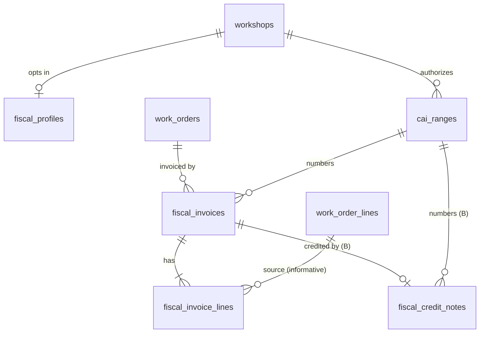
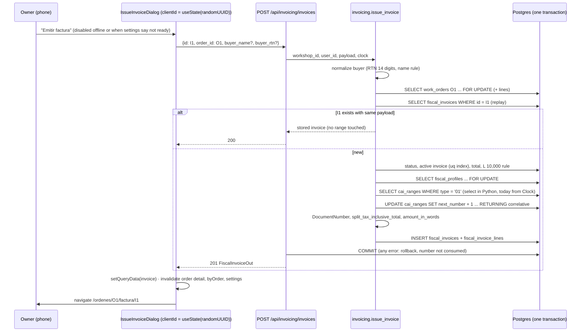
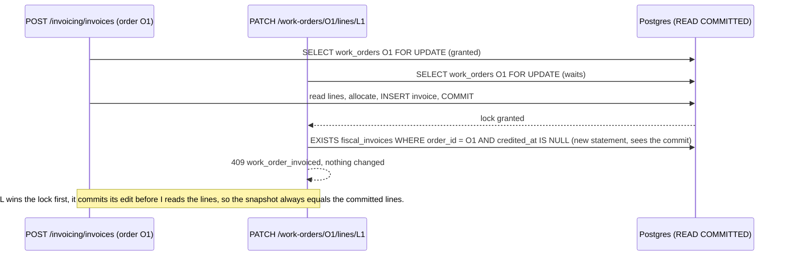

# Design: SAR invoicing (opt-in Factura and Nota de Crédito from work orders)

Change: `sar-invoicing` · Inputs: `proposal.md` (approved 2026-10-08; every assumption A1–A13 and product question 1–11 is decided with its recommended answer), `exploration.md`, and the research note `docs/research/notas/_research-sar-facturacion.md`. Article numbers refer to the consolidated Reglamento of Acuerdo 481-2017 unless marked CT (Código Tributario). The research note is not legal advice: a contador confirms the module before any workshop issues real documents with it (proposal question 1).

The capability specs (`specs/`) are not written yet; "Spec reconciliation" below lists what this design fixes that the specs must state.

## Technical Approach

Two phases, one PR each (A13). Each phase is a vertical slice through the API (a new hexagonal feature package), the web (a new feature folder plus small edits to customers, work orders and the shell) and the demo seed. No new runtime dependency is introduced on either side.

- **API package.** `taller/invoicing/` owns the fiscal profile, CAI ranges, Facturas (phase A) and Notas de Crédito (phase B). It depends on `workorders` in one direction only (application to application, like `workorders` to `inventory`). `workorders` learns whether an order is invoiced through a schema-only, table-name reference to `fiscal_invoices`, the same pattern inventory uses to show order numbers in item history (AD-1, AD-2).
- **Numbering.** Every CAI authorization is one `cai_ranges` row holding its own `next_number`. Allocation happens inside the issuance transaction, under a fixed lock order (order row, then the workshop's fiscal profile row, then the range row), so numbers are gap-free and an idempotent replay never consumes one (AD-4 to AD-6).
- **Documents.** An issued document is an immutable snapshot of every printed field, including the total in words, which is generated once in Python and stored (AD-9, AD-10). A Postgres trigger rejects updates and deletes of issued documents, except the single `credited_at` stamp that phase B writes (AD-10).
- **Tax.** Line prices already include 15% ISV (D1). The invoice derives the gravado base from the order total with one integer rounding, and ISV is the remainder, so gravado + ISV equals the total exactly (AD-8).
- **Web.** `web/src/features/invoicing/` follows the existing feature shape (`api.ts`, `copy.ts`, `hooks.ts`, `routes.tsx`, containers and presentational components). Settings sit under the shell's "Más" menu, issuance is a dialog on the order detail, and print routes render outside `AppShell` like the receipts. Every write is online-only, and reads are persisted under `workshopQueryKey` (AD-15 to AD-17).

## Codebase facts this design builds on

Verified in this session through CodeGraph (verbatim source) and the baseline specs:

| Fact | Where |
|---|---|
| Every mutating work-order use case starts with `order_repo.get_for_update(...)`, then checks `order.status not in EDITABLE` and raises `WorkOrderLocked`. `update_work_order` (order fields), `update_line` and `remove_line` follow this order. | `api/src/taller/workorders/application/use_cases.py:393-408, 535-544, 595-607` |
| `add_line` runs replay detection (`_find_line` + `_line_fields_match`) **before** the `EDITABLE` check. `remove_line` returns early on an already-removed line, also before the check. | `use_cases.py:444-464, 599-607` |
| Routes commit inside the `try`, roll back and map each domain error to an English `detail` code; `MovementIdConflict` is 409 `movement_id_conflict`, `StockOutOfRange` is 422 `stock_out_of_range`. | `api/src/taller/workorders/adapters/router.py:494-521` |
| The order-create route retries the use case once after a primary-key `IntegrityError`, rolling back first so the counter bump is undone. | `router.py:209-228` |
| `WorkOrderLocked` is the 409 `work_order_locked` error for `delivered` and `cancelled`. | `api/src/taller/workorders/domain/errors.py:38-45`; `openspec/specs/work-orders/spec.md:163-192` |
| The `WorkOrder` entity carries `status`, `complaint`, `odometer_km`, `notes`, the five status timestamps and all lines, removed ones included. | `api/src/taller/workorders/domain/entities.py:48-77` |
| Work-order schemas import `EDITABLE`, `PAYABLE`, `TRANSITIONS` and `order_total_cents`; `WorkOrderSummaryOut.from_domain(order, *, vehicle, customer, total_cents)`. | `api/src/taller/workorders/adapters/schemas.py:7-27, 251-255` |
| The work-orders spec forbids any tax amount in the order response. | `openspec/specs/work-orders/spec.md:91-100` |
| `create_customer` compares `{full_name, phone, notes}` for replay; the customer id is optional on create (`id: uuid.UUID \| None = None`). | `api/src/taller/customers/application/use_cases.py:38-90`; `customers/adapters/schemas.py:23-27` |
| `Customer` has `full_name`, `phone`, `notes`, `archived_at`, `created_at`, `updated_at`, with `phone_is_mobile` derived. | `api/src/taller/customers/domain/entities.py:17-47` |
| `get_clock()` returns `SystemClock()` and is the injectable clock tests override. | `api/src/taller/identity/adapters/dependencies.py:39-41` |
| The insert-then-`FOR UPDATE` idiom for a row that may not exist yet (`ON CONFLICT DO NOTHING`, then `with_for_update().populate_existing()`). | `api/src/taller/identity/adapters/repositories.py:94-116` |
| `migrations/env.py` imports each feature's `adapters.models` explicitly; `MIGRATION_ONLY_INDEXES = frozenset({"ix_inventory_items_active_name"})`. | `api/migrations/env.py:10-13, 34` |
| Receipt routes are lazy siblings of `<AppShell>` under the pathless `RequireSession` route. | `web/src/app/router.tsx:56-72` |
| The "Más" menu is a `Dialog` in `AppShell`, which reads `const isOffline = useOnlineStatus()` (the hook returns `true` while offline). | `web/src/app/AppShell.tsx:30-81` |
| `getDemoAccount()` reads `VITE_DEMO_PHONE`/`VITE_DEMO_PASSWORD` on every call (so tests can stub them) and returns `null` outside the demo build. | `web/src/features/auth/demoAccount.ts:11-18`; `deploy/demo/README.md:47-67, 160-161` |
| The auth `Workshop` type is `{id, name}`. | `web/src/features/auth/api.ts:10-13` |
| The export spec fixes seven files today. | `openspec/specs/data-export/spec.md:11-25` |

Not readable in this session (the read hook blocked files CodeGraph had marked as already returned, and the two-call CodeGraph budget was spent). The design names the behavior, and the first task of the slice that touches each one confirms the identifier before writing code:

- the exact signature of `order_total_cents` (`workorders/domain/money.py:13`) and of `WorkOrderRepository.get_for_update` (whether it loads lines with `populate_existing`);
- the line of `WorkOrderOut` that sets `lines_editable = order.status in EDITABLE` (`schemas.py:317` per the exploration) and the router's `_to_out` signature;
- the module that defines the `Clock` protocol, and where `daily_cash_summary` keeps its `ZoneInfo("America/Tegucigalpa")`;
- whether `api/tests/conftest.py` builds the test schema through Alembic or `metadata.create_all` (it decides how the AD-10 trigger reaches the test database);
- the content of `web/src/test/handlers.ts`, the receipt's measured-height code, and `export/adapters/sources.py`'s function shape.

## Corrections to the proposal (non-blocking)

1. **MSW handlers.** The proposal lists `web/src/test/handlers.ts` as "Modified (A, B): handlers for every new endpoint". The established pattern (archived `workshop-core` design, correction 3; `CLAUDE.md`) is a `server.use(...)` per test, and `setup.ts` fails any test that leaves a request unmocked. New tests follow that pattern; `handlers.ts` changes only if its current content says otherwise.
2. **Receipt code stays untouched.** The proposal puts "any change to the non-fiscal receipt" out of scope. This design therefore does not extract the receipt's measured-`@page` code into a shared helper: invoicing gets its own print primitives (AD-16). Converging both onto one helper is a follow-up refactor.
3. **Issuance flow.** The proposal's four steps (lock order, check eligibility, lock range, write snapshot) gain two refinements: replay detection runs right after the order lock and before every eligibility check, and the workshop's `fiscal_profiles` row is locked between the order and the range (AD-5, AD-6).
4. **Rollback commands.** The proposal's demo rollback runs `alembic downgrade <prev>` unchanged. With AD-20, a downgrade over fiscal rows refuses unless it receives `-x discard_fiscal_documents=demo`; the runbook gains that flag.
5. **Opt-in gate wording.** "Until the profile is complete" becomes "until a profile exists": the profile endpoint rejects any incomplete payload, so a stored profile is always complete (AD-3).
6. **Export contents.** Phase B exports three new CSVs (invoices, invoice lines per question 11, credit notes), and `customers.csv` gains `billing_name` and `rtn` so the new customer data is not left out of "Exportar todo" (AD-19). The second point is a small spec delta for `data-export`.

## Architecture Decisions

### AD-1: A new `taller.invoicing` feature package, depending on `workorders` one way

**Choice.**

```
invoicing.domain ─────────────► customers.domain.Rtn, identity.domain.PhoneNumber   (value objects)
invoicing.application ────────► workorders.application.ports.WorkOrderRepository    (port type)   AD-6
invoicing.application ────────► workorders.domain (WorkOrderStatus, order_total_cents)
invoicing.adapters.router ────► workorders.adapters.repositories                    (composition root only)
invoicing.adapters.models ────► "work_orders", "work_order_lines" FKs by name        (newer → older)
workorders.adapters.repositories ─► "fiscal_invoices" table by name                  (lock flag)    AD-2
export.adapters.sources ──────► invoicing.adapters.models                           (read-only)    AD-19
```

- `taller/invoicing/` holds `domain/` (profile, range, document number, tax split, amount in words, buyer rules, documents), `application/` (use cases and `Protocol` ports) and `adapters/` (models, repositories, schemas, `invoicing_router`), mounted in `taller/main.py` under `/api`.
- The fiscal profile and CAI ranges live in `invoicing` (tables `fiscal_profiles`, `cai_ranges`), not in `identity`. `Workshop` and `WorkshopRepository` stay untouched (AD-3).
- The RTN value object lives in `customers.domain` (`rtn.py`), because the customer's RTN is the first place it is stored, and `invoicing.domain` reuses it for the issuer and the buyer, exactly as `customers` reuses `identity`'s `PhoneNumber` (archived AD-8).

**Alternatives considered.**
1. Invoicing inside `workorders`, as payments are (archived AD-11). Rejected: fiscal profile and CAI ranges are workshop-level concepts with no order in them, and the order aggregate would gain a second domain with its own lock, numbering and immutability rules.
2. Columns on `workshops` for the fiscal profile. Rejected in the exploration: it needs a new identity update path and nullable fiscal columns on every tenant.

**Rationale.** Every application-to-application arrow keeps pointing from the newer, higher-level feature to the older one, which is the rule archived AD-1 established. The only reverse reference is schema-level (AD-2). Invoicing reads the order through the same port type and repository class `workorders` already uses, so issuance shares the order-row lock instead of reimplementing it.

### AD-2: `workorders` reads the invoiced-order lock through a schema-only reference to `fiscal_invoices`

**Choice.**

- `WorkOrderRepository` gains one method, `active_invoice(*, workshop_id, order_id) -> InvoiceRef | None`, where `InvoiceRef(id, number)` is a frozen dataclass in `workorders.domain.entities`.
- `SqlAlchemyWorkOrderRepository` implements it with a lightweight `sqlalchemy.table("fiscal_invoices", column("id"), column("workshop_id"), column("order_id"), column("number"), column("credited_at"))` and `WHERE workshop_id = :w AND order_id = :o AND credited_at IS NULL`. It never imports an invoicing module.
- `add_line`, `update_line` and `remove_line` call it right after their existing `EDITABLE` check. A non-null result raises a new `WorkOrderInvoiced(order_id)`, which the router maps to 409 `work_order_invoiced`.
- The router's `_to_out` asks for it once per response, and `WorkOrderOut` gains `active_invoice: {id, number} | null`. `lines_editable` becomes `order.status in EDITABLE and active_invoice is None`.

The check runs **after** the order-row lock, so it reads the state that issuance committed (AD-5). Check order is unchanged for existing cases: the replay paths of `add_line` and `remove_line` still answer first, and `delivered`/`cancelled` still answer `work_order_locked` before the invoice check is reached.

**Alternatives considered.**
1. A `workorders`-owned `InvoiceLockReader` port implemented by an invoicing adapter and injected by the `workorders` router. Rejected: the `workorders` router would import `invoicing.adapters` while `invoicing.application` imports `workorders`, a two-way package dependency that archived AD-1 ruled out. It would also add a second set of fakes for one `EXISTS`.
2. A denormalized `work_orders.invoiced` flag that invoicing sets through a `workorders` application function. Rejected: two sources of truth for one fact, and the proposal's rollback relies on the lock being derived from the invoices table ("orders ... are unaffected, because the lock is derived from the invoices table").
3. Invoicing rejecting line edits itself. Rejected: line edits never pass through invoicing.

**Rationale.** It is the exact precedent `CLAUDE.md` documents for inventory, where `inventory_movements` reads `work_orders` by table-name string, never by Python import. The query uses the partial unique index of AD-10, so it costs one index probe.

### AD-3: The fiscal profile is its own table, validated complete on save; the opt-in gate is derived readiness

**Choice.**

- `fiscal_profiles` has one row per workshop, keyed by `workshop_id`. A workshop that never opts in has no row, and every existing behavior (orders, payments, receipts, export) is untouched.
- `PUT /api/invoicing/profile` takes the whole profile, and every field is required: RTN, razón social, nombre comercial, address, phone, email, establecimiento code and punto de emisión code (Art. 10–11 require all of them on every printed Factura). A stored profile is therefore always complete.
- **Readiness** is computed, never stored: a document type is *ready* when a profile exists and a usable range of that type exists today (AD-4). The same pure function feeds `GET /api/invoicing/settings` (what the web shows) and issuance (what the server enforces), so the button and the rule cannot disagree.
- **Code lock.** Changing `establishment_code` or `emission_point_code` is rejected with 409 `fiscal_profile_codes_locked` while any range of the workshop is still *active* or *standby* (AD-4). A CAI is granted per punto de emisión and document type (Art. 59, 61), so a usable range must never print under different codes than it was granted for. Each range also copies the codes at registration, so finished ranges keep displaying their own codes after a later change.

**Alternatives considered.**
1. An explicit "enable invoicing" toggle. Rejected in the exploration: a state that can disagree with the data.
2. Allowing a partial profile and computing completeness. Rejected: it adds a "complete?" state to keep in sync, while every field is mandatory on the document anyway.
3. Keeping the codes only on the range. Rejected: A2 fixes one establecimiento and one punto per workshop, which belongs to the workshop, not to each range.

**Rationale.** The gate follows A1 ("opt-in by data") with no flag to drift. Requiring email follows the research note's Art. 10–11 list; whether a workshop without email may omit it is a contador question (Open Questions).

### AD-4: Each CAI range is a bounded counter row; its state is derived; the range that expires first is used first

**Choice.**

- One `cai_ranges` row per authorization: `document_type` (`01` or `06`), `cai`, `range_start`, `range_end`, `next_number`, `issue_deadline` (the fecha límite de emisión), and the codes copied from the profile.
- **No stored active flag.** The state is derived from the row and today's date in `America/Tegucigalpa` (AD-7):

  | State | Condition |
  |---|---|
  | `expired` | `today > issue_deadline` (Art. 62: invalid whatever range remains) |
  | `exhausted` | `next_number > range_end` and not expired |
  | `active` | the usable range chosen by the selection rule below |
  | `standby` | usable, but not chosen (a pre-registered next range) |

- **Selection.** Among usable ranges of a type (numbers left and `today <= issue_deadline`), pick the earliest `issue_deadline`, then the lowest `range_start`, then `id`. Using the range that expires first wastes the fewest numbers, since Art. 62 voids whatever is left at the fecha límite.
- **Pre-registration (Art. 59).** A next range may be registered at any time while the current one is still in use. It waits as `standby` and takes over automatically, in the same issuance that finds the current one exhausted or expired, with no user action. Art. 59 limits when the workshop may *request* a new range from SAR; enforcing that request window is SAR's job, not the app's.
- **Overlap.** A new or edited range is rejected with 409 `cai_range_overlap` when it intersects `[range_start, range_end]` of another range of the same workshop, document type, establecimiento and punto de emisión. Ranges never overlap within one prefix, so the formatted number `NNN-NNN-TT-NNNNNNNN` is unique per workshop (and `UNIQUE (workshop_id, number)` on the document tables backs it).
- **Immutability.** A range is `in_use` once `next_number > range_start`. While unused it may be corrected with `PATCH` (a mistyped CAI or deadline is the most likely error, and it would otherwise be printed on a legal document); once used, `PATCH` returns 409 `cai_range_immutable`. Ranges are never deleted.
- **Registration bounds.**
  - `1 <= range_start <= range_end <= 99,999,999`, or 422 `invalid_cai_range`.
  - `issue_deadline >= today`, or 422 `cai_deadline_passed`.
  - `issue_deadline <= today + 366 days`, or 422 `cai_deadline_too_far`. A CAI is valid for at most one year (Art. 62), so a deadline further away can only be a typo (for example the wrong year).
- **CAI text.** The CAI is uppercased and stripped of whitespace, then must match `^[0-9A-Z]+(-[0-9A-Z]+)*$` with length 10–50, or 422 `invalid_cai`. The research note gives no CAI format, so v1 does not enforce the commonly seen 37-character grouping. The form shows the CAI back for confirmation, and the unused-range `PATCH` is the correction path.
- **Phase A** accepts only `document_type = "01"` through the API (422 `unsupported_document_type` for `06`); phase B opens `06`. The database check allows both from phase A on, so phase B needs no constraint change.
- **Correlative wrap-around** (`99999999` back to `00000001`, Art. 10–11) is not supported: no realistic workshop issues 99,999,999 documents, and supporting it would weaken the overlap and uniqueness rules above.

**Alternatives considered.**
1. Reusing `workshop_counters` with a new name. Rejected in the proposal: unbounded, no expiry, no link to a CAI.
2. A stored `is_active` flag. Rejected: expiry happens by the passage of time with no write, so a stored flag is stale by construction at midnight after the fecha límite.
3. Lowest `range_start` first. Rejected: a pre-registered range with a lower start would be used before the current one, leaving the current one's numbers to expire unused.
4. An `EXCLUDE USING gist` constraint for overlap. Rejected: it needs the `btree_gist` extension and is invisible to `alembic check`. Overlap is serialized by the profile lock instead (AD-5).

**Rationale.** The row carries every fact the allocation needs (bound, deadline, next number), so one locked row decides everything (A8).

### AD-5: Lock order, and the profile row as the per-workshop fiscal mutex

**Choice.** One global lock order, extending archived AD-5:

1. `work_orders` row (`get_for_update`): issuance, credit notes, every line edit, status change and payment.
2. `fiscal_profiles` row (`SELECT … FOR UPDATE`): issuance, credit notes, range create and `PATCH`, and profile `PUT`.
3. `cai_ranges` row: the allocation `UPDATE` (below) locks it implicitly.
4. `fiscal_invoices` row, for credit notes only (phase B: `SELECT … FOR UPDATE`, then the `credited_at` stamp).
5. `inventory_items` rows in ascending `(item_id, line_id)` order, taken only by stock reconciliation, which never runs in a fiscal transaction.
6. `workshop_counters` row, taken only by order creation.

No transaction takes a lock out of this order: a profile `PUT` and a range write start at step 2 and take nothing from step 1. Issuance never locks items, and line edits never lock the profile, so there is no cycle.

Allocation is one statement under the profile lock:

```sql
UPDATE cai_ranges SET next_number = next_number + 1, updated_at = :now
WHERE id = :range_id AND next_number <= range_end
RETURNING next_number - 1;
```

**Alternatives considered.**
1. Locking only the selected range with `SELECT … ORDER BY … LIMIT 1 FOR UPDATE`. Rejected: under READ COMMITTED, a locked row that no longer satisfies the `WHERE` after the wait is dropped, and with `LIMIT 1` the query can return **no row** even though a standby range is usable. The second of two concurrent issuers would then get a false `cai_range_exhausted`.
2. Locking every range of the type `FOR UPDATE` without `LIMIT`. Workable for selection, but it does not serialize range *creation*: with no existing row, two concurrent overlapping creates both pass the overlap check.
3. A per-type advisory lock. Rejected: invisible in the schema and in `pg_locks` reasoning, and unlike the rest of the codebase.

**Rationale.** Every fiscal write already needs the profile (ranges copy its codes, documents snapshot it), so its row is a natural, always-present mutex. It serializes overlap checks, range selection, allocation and code changes for one workshop. The cost is that one workshop's fiscal writes run one at a time, which is irrelevant at a few documents per day. Concurrent issuance across workshops never contends. The range row lock still exists (the `UPDATE` takes it), and `UNIQUE (cai_range_id, correlative)` is the last line of defense.

### AD-6: Issuance is one transaction; replay comes first and consumes no number

**Choice.** `POST /api/invoicing/invoices` with `{id, order_id, buyer_name?, buyer_rtn?}` runs `issue_invoice` in this order:

1. Normalize the buyer fields (pure): RTN through `Rtn.from_raw` (422 `invalid_rtn`); an RTN without a name is 422 `buyer_name_required`.
2. Lock the order (`order_repo.get_for_update`), or 404 `work_order_not_found`. Line edits take this same lock, so no line can change between this point and commit.
3. **Replay.** If `invoice_id` exists in this workshop: when `{order_id, buyer_name, buyer_rtn}` match, return it (200); otherwise 409 `invoice_id_conflict`. **No range is touched.**
4. Eligibility:
   - status in `INVOICEABLE = {completed, delivered}`, or 409 `work_order_not_invoiceable`;
   - no active invoice for the order, or 409 `work_order_already_invoiced`;
   - total > 0, or 409 `invoice_amount_zero`; total < L 1,000,000,000,000.00, or 409 `invoice_amount_too_large` (the words function's bound, AD-9);
   - from L 10,000.00 (`total_cents >= 1_000_000`), both buyer name and RTN, or 422 `buyer_identification_required` (AD-11).
5. Lock the profile, or 409 `fiscal_profile_missing`.
6. Select the usable `01` range for `today` (AD-4, AD-7), or 409 `cai_range_missing`, `cai_range_exhausted` or `cai_range_expired`.
7. Allocate the correlative (AD-5).
8. Build and insert the snapshot (AD-10): number, issuer, CAI block, buyer, lines from the order's non-removed lines in display order, the tax split (AD-8) and the total in words (AD-9).

The route commits once. On an `IntegrityError` naming `fiscal_invoices_pkey`, it rolls back (which also undoes the allocation) and retries once; the retry now takes the replay path. A second failure is 409 `invoice_id_conflict` (a cross-tenant id collision, as for orders). Any other integrity error re-raises.

When no range is usable, the code follows a fixed rule: `cai_range_missing` if the type has no range at all; else `cai_range_expired` if any range still has numbers (so all of those are expired); else `cai_range_exhausted`.

**Alternatives considered.**
1. Allocating the number before the replay check. Rejected: a retried request would burn a number, which is the defect archived AD-6 prevented for order numbers.
2. Issuing through the outbox, or offline. Out of scope: a fiscal number must be allocated by the server under its lock.
3. A server-generated id. Rejected (archived AD-14): a retry without a client id cannot be made safe.

**Rationale.** Replay first, then state checks, then numbering is the codebase's settled order (archived AD-6, AD-11, AD-14). The order lock both serializes two issuances of the same order and closes the snapshot-versus-line-edit race.

### AD-7: The fecha límite is compared as a Honduran calendar date through the injectable clock

**Choice.**

- `HONDURAS_TZ = ZoneInfo("America/Tegucigalpa")` and `local_today(clock) = clock().astimezone(HONDURAS_TZ).date()` live in a new `taller/shared/timezone.py`. Invoicing uses them; `workorders` keeps its own constant (moving it would edit the cash summary, which is out of scope, so adopting the shared module there is a follow-up).
- A range is usable on day `d` when `d <= issue_deadline`: the fecha límite day itself is included (Art. 62).
- `issued_at` (timestamptz) comes from the same clock, and `issue_date = issued_at` in Honduran time is stored next to it, so the printed date never depends on the reader's time zone.
- Every invoicing route depends on `get_clock`, and tests override it, as login throttling and the cash summary do.
- A database check, `issue_date <= issue_deadline`, is the last line of defense on both document tables.

**Alternatives considered.** Comparing UTC dates, or `now()` in SQL. Rejected: between 18:00 and 24:00 local time, the UTC date is already tomorrow, which would block issuance on the fecha límite evening. A fixed `UTC-6` offset was rejected in archived AD-20.

**Rationale.** It is the cash summary's day-boundary rule applied to a legal date, and it is testable at the exact boundary (`05:59Z` versus `06:00Z`).

### AD-8: ISV is split once from the invoice total; printed line values are tax-inclusive

**Choice.**

- One tarifa (15%, A4), one split, on the invoice total `T` (integer cents, tax-inclusive per D1):

  ```
  taxable_15 = round(T × 100 / 115) = (2·100·T + 115) // (2·115)    # integer only
  isv_15     = T − taxable_15
  ```

  `exempt_cents`, `exonerated_cents` and `discount_cents` are stored as 0 and printed as L 0.00 (question 9).
- `taxable_15 + isv_15 == T` holds by construction, for every `T`.
- **No tie can occur.** `100T/115 = 20T/23`, whose fractional part is `k/23` and never exactly `1/2`, so the rounding mode does not matter.
- `isv_15` differs from 15% of the printed base by at most 0.575 cents, so it is always within one cent of `round(0.15 × taxable_15)`.
- **Line values printed as entered** (tax-inclusive), under a column labeled "Precio (ISV incluido)", with line totals that sum exactly to `T`. The breakdown block below the lines prints gravado 15%, ISV 15%, exento, exonerado, descuentos and the total.

**Worked example.** An order of L 1,000.00 (`T = 100000`), which does not divide evenly by 1.15:

| Step | Value |
|---|---|
| `100T/115 = 20T/23` | 86956.52… |
| `taxable_15 = (200·100000 + 115) // 230` | 86957 (L 869.57) |
| `isv_15 = 100000 − 86957` | 13043 (L 130.43) |
| Check | 86957 + 13043 = 100000 ✔ |
| The rejected forward rule, `isv = round(0.15 × 86957) = round(13043.55)` | 13044, so 86957 + 13044 = 100001: one cent over the total |

More values, all exact:

| Order total | Gravado 15% | ISV 15% |
|---|---|---|
| L 1,150.00 (success criterion) | L 1,000.00 | L 150.00 |
| L 400.00 (demo seed) | L 347.83 | L 52.17 |
| L 1,570.00 | L 1,365.22 | L 204.78 |
| L 0.01 | L 0.01 | L 0.00 |

**Alternatives considered.**
1. ISV per line, then summed. Rejected: per-line rounding makes the sum of line bases differ from the base of the total by up to half a cent per line, the breakdown is required per tarifa (Art. 10–11) and not per line, and every line is at the same rate.
2. Printing tax-exclusive unit values. Rejected: each unit base would need its own rounding, so `quantity × unit base` would no longer add up to the printed gravado without a largest-remainder fix-up that prints values nobody entered. The tax-inclusive values are exactly what the customer agreed to on the quote and receipt (D1).
3. Floating point (`T / 1.15`). Rejected: no float anywhere (archived AD-10).

**Rationale.** It is the only scheme in which the printed breakdown, the line sum and the total all agree to the cent with no correction step. Whether SAR expects tax-exclusive line values is a contador question; switching later changes only the print layer and the snapshot's line columns.

### AD-9: The total in words is a small in-house pure function, run once and stored

**Choice.** `amount_in_words(total_cents: int) -> str` in `invoicing/domain/amount_in_words.py`, with no dependency:

- **Integer part**, split into groups (millions, thousands, units), each 0–999 rendered from three tables. Units 0–29 include `DIECISÉIS`, `VEINTIÚN`, `VEINTIDÓS`, `VEINTITRÉS` and `VEINTISÉIS`; tens 30–90 join with `Y`; hundreds use `CIEN` for exactly 100 and `CIENTO`, `DOSCIENTOS` through `NOVECIENTOS` (with `QUINIENTOS`, `SETECIENTOS`, `NOVECIENTOS`) otherwise.
- **Apocope everywhere.** The number always precedes a noun (`MIL`, `MILLONES`, `LEMPIRAS`), so 1 renders as `UN`, 21 as `VEINTIÚN` and 31 as `TREINTA Y UN`.
- **Thousands.** A thousands group of exactly 1 renders `UN MIL`. That is the convention in the brief's example and in Honduran financial documents (it prevents a prefix being added by hand); otherwise `<group> MIL`.
- **Millions.** `UN MILLÓN`, or `<group> MILLONES`. A number that is an exact multiple of a million takes `DE` before the currency (`UN MILLÓN DE LEMPIRAS`).
- **Currency.** `LEMPIRA` when the integer part is 1, otherwise `LEMPIRAS`. Zero is `CERO`.
- **Cents.** ` CON NN/100`.
- **Bound.** Valid up to 999,999,999,999 lempiras; above that it raises, and issuance answers 409 `invoice_amount_too_large` first (AD-6).

Examples: `115000` gives "UN MIL CIENTO CINCUENTA LEMPIRAS CON 00/100"; `100` gives "UN LEMPIRA CON 00/100"; `202100150` gives "DOS MILLONES VEINTIÚN MIL UN LEMPIRAS CON 50/100"; `50` gives "CERO LEMPIRAS CON 50/100".

The text is computed at issuance and stored in `total_in_words`. A credit note copies its Factura's text (AD-13). A later change to the function never alters an issued document.

**Alternatives considered.** `num2words` (`lang="es"`). Rejected: a new runtime dependency for about 60 lines; it renders lowercase `mil` (not `UN MIL`), so the output would need post-processing anyway; and its apocope and accent behavior would become an untested external contract on a legal document.

**Rationale.** A table-driven function with an exhaustive example table is easier to verify than a library's locale rules (Art. 10–11, Art. 25–26 require the total in words).

### AD-10: Immutable snapshots in two document tables, guarded by a trigger

**Choice.**

- Phase A creates `fiscal_invoices` and `fiscal_invoice_lines`; phase B creates `fiscal_credit_notes`. Each document row holds every printed field (see "Printed field map"), copied at issuance from the profile, the range, the request and the order. Nothing is ever rendered from live data.
- `fiscal_invoices.credited_at` is the only column ever written after insert: once, from NULL to a timestamp, by the credit note transaction (phase B).
- A plpgsql trigger, `taller_fiscal_invoice_guard` (`BEFORE UPDATE OR DELETE`), raises on any `DELETE` and on any `UPDATE` other than that `credited_at` transition. A second function, `taller_fiscal_append_only`, rejects every `UPDATE` and `DELETE` on `fiscal_invoice_lines` and `fiscal_credit_notes`. Foreign keys are `ON DELETE RESTRICT` everywhere.
- `UNIQUE (order_id) WHERE credited_at IS NULL` (`uq_fiscal_invoices_order_active`, declared on the model with `postgresql_where`) enforces one non-credited Factura per order (A3, A6). AD-2's lock probe uses the same index.

**Alternatives considered.**
1. One `fiscal_documents` table for both types. Rejected: half the columns would be type-specific and nullable (lines, reason, references), every constraint would need a type guard, and the proposal's rollback ("phase B's `downgrade()` drops the credit notes table") and export ("invoices and credit notes CSVs") already assume two tables. Shared columns are factored as Python dataclasses (`IssuerSnapshot`, `CaiSnapshot`, `Amounts`) and an ORM mixin, not as one table.
2. Rendering from the live order, customer and profile. Rejected in the exploration: a later edit would silently change a reprint (Art. 53.2–53.3).
3. Immutability by convention only. Rejected: Art. 53.2 asks for "mecanismos de seguridad y controles de auditoría", and a trigger stops an application bug or an ad-hoc script from rewriting a legal document.
4. A JSON snapshot column. Rejected: the export, the constraints and the checks below need typed columns.

**Rationale.** Snapshots make reprints exact and satisfy custody (Art. 5, 41, 43). Triggers are not compared by `alembic check`, so they add no drift. Concurrency tests clean up committed rows with `TRUNCATE`, which row triggers do not intercept.

### AD-11: Buyer rules and the RTN value object

**Choice.**

- `Rtn.from_raw(raw)` strips spaces and `-`; the result must be exactly 14 digits, or `InvalidRtn` (422 `invalid_rtn`). There is no check-digit validation (question 10). It lives in `customers/domain/rtn.py`, and invoicing reuses it for the issuer and the buyer (AD-1).
- **Buyer at issuance.**
  - Neither name nor RTN: "CONSUMIDOR FINAL".
  - A name alone: a named consumidor final.
  - Name and RTN: an identified buyer.
  - An RTN alone: 422 `buyer_name_required`.
- **From L 10,000.00**, compared against the tax-inclusive total (question 4), both name and RTN are required, or 422 `buyer_identification_required`.
- The snapshot stores `buyer_name = NULL` and `buyer_rtn = NULL` for "CONSUMIDOR FINAL"; the legend is printed from `copy.ts` (AD-14). Database checks back both rules: `buyer_rtn IS NULL OR buyer_name IS NOT NULL`, and `total_cents < 1000000 OR (buyer_name IS NOT NULL AND buyer_rtn IS NOT NULL)`.
- **Customer billing data** (A5): nullable `customers.billing_name` and `customers.rtn`, validated when present (`ck_customers_rtn_digits`), included in the create-replay comparison and editable through `PATCH`, where an explicit `null` clears them. The issuance dialog prefills from them (`billing_name`, falling back to `full_name`), and the user may edit before issuing. Issuance never writes back to the customer.

**Alternatives considered.** The server defaulting the buyer from the customer when the request omits it. Rejected: the client must state the buyer it shows, or a stale prefill could print a buyer the user never saw. Writing edited buyer data back to the customer was also rejected: it is a cross-feature write that issuance does not need.

**Rationale.** This is A5 and question 4 as decided, with the database repeating the legally critical rule.

### AD-12: The document number is a value object; its parts are stored separately

**Choice.** `DocumentNumber(establishment, emission_point, document_type, correlative)`, where `str()` gives `NNN-NNN-TT-NNNNNNNN` (`001-001-01-00000001`, Art. 10–11). The codes are 3 digits each, the type is `01` or `06`, and the correlative is 1–99,999,999, zero-padded to 8 digits. Each document stores `correlative` (integer, unique per range) and `number` (`varchar(19)`, unique per workshop). The printed "rango autorizado" is two formatted numbers from the range bounds (`001-001-01-00000001 al 001-001-01-00000500`), stored on the snapshot as `range_first_number` and `range_last_number`.

**Alternatives considered.** Storing only the formatted string. Rejected: `UNIQUE (cai_range_id, correlative)` needs the integer, and the range checks compare integers.

**Rationale.** Formatting happens once in pure code (unit-tested), and two unique constraints catch any allocation bug.

### AD-13: Credit notes (phase B): full amount, credited once, lock released by data

**Choice.** `POST /api/invoicing/credit-notes` with `{id, invoice_id, reason}`, in one transaction:

1. Read the invoice (404 `invoice_not_found`); lock its order row; replay on `{invoice_id, reason}` (200, or 409 `credit_note_id_conflict`).
2. Lock the invoice row; `credited_at IS NOT NULL` is 409 `invoice_already_credited` (a Factura is credited once, A6).
3. Lock the profile; select and allocate from the usable `06` range (the same codes as AD-6, for type `06`).
4. Insert the credit note snapshot:
   - issuer data from the profile *now*, since this document is issued now;
   - its own CAI block;
   - the buyer name and RTN copied from the Factura;
   - the original's CAI, number and date (Art. 25–26);
   - the reason (trimmed, 1–300 characters, or 422 `invalid_credit_note_reason`);
   - the amounts and total in words copied from the Factura (full amount only, A6).
5. Stamp `fiscal_invoices.credited_at = issued_at` (the only update the AD-10 trigger allows).

Effects:

- **Lock release.** AD-2's probe no longer finds an active invoice, so a `completed` order's lines are editable again and the order may be invoiced again.
- **Re-invoicing a delivered order.** A `delivered` order keeps its lines locked by the existing `work_order_locked` rule, so it can only be re-invoiced for the same amount with corrected buyer data (question 5). That needs no special code, because eligibility is just "invoiceable status and no active invoice".
- **No other side effects.** Payments and stock are untouched (question 8); a refund is recorded by voiding payments through the existing flow.

**Alternatives considered.**
1. "ANULADA" (Art. 41). Out of scope (A6, A12).
2. Partial credit notes. Out of scope.
3. Recomputing the words for the credit note. Rejected: copying guarantees identical text for identical amounts.

**Rationale.** It is the only legal correction after issuance (Art. 4.32, 25–26), and every lock effect is derived from data (A6).

### AD-14: The API stays Spanish-free except for the stored total in words

**Choice.** Every error is an English `detail` code mapped in `web/src/features/invoicing/copy.ts`. Fixed legends ("FACTURA", "NOTA DE CRÉDITO", "CONSUMIDOR FINAL", "ORIGINAL: CLIENTE", "COPIA: EMISOR", the column labels and the demo watermark) live in `copy.ts`, never in the database. The only Spanish text the API returns is `total_in_words`, which is document **content**: it is generated once, stored, and must never change on reprint (AD-9), like a customer's name.

**Alternatives considered.**
1. Generating the words on the web. Rejected: a later web deploy would change the text of documents already issued.
2. Storing the legends in the snapshot. Rejected: they are constants, and the codebase rule is that Spanish UI copy lives only in `copy.ts`.

**Rationale.** This keeps `CLAUDE.md`'s rule ("the API itself never returns Spanish") for everything except a field whose immutability matters more.

### AD-15: Web structure, settings location and query keys

**Choice.**

- **Feature folder.** `web/src/features/invoicing/` holds `api.ts`, `copy.ts`, `hooks.ts` and `routes.tsx`, plus subfolders `settings/`, `issue/`, `documents/` and `print/` (see File Changes). Containers fetch; presentational components take props.
- **Settings location.** The "Más" menu gains "Facturación", which navigates to `/ordenes/facturacion`, following the `/ordenes/caja` precedent: it is nested in `<AppShell>`, keeps the Órdenes tab active, and is lazy, since most workshops never open it. Sub-routes:
  - `/ordenes/facturacion/datos` for the profile form;
  - `/ordenes/facturacion/rangos/nuevo` and `/ordenes/facturacion/rangos/:rangeId` for the range forms.

  The settings page shows the SAR notice (A11), the readiness per document type, the profile summary, and the ranges with their state, remaining numbers and formatted bounds.
- **Order detail.** A "Documentos fiscales" section (`issue/InvoiceSection`) appears only when a profile exists, so a workshop that never opts in sees no change:
  - with `order.active_invoice`, it links to `/ordenes/:orderId/factura/:invoiceId`;
  - else, with status `completed`/`delivered` and readiness `01` ready, it offers "Emitir factura" (disabled offline);
  - else, it shows the blocked reason ("rango vencido") linking to settings.

  Credited invoices and credit notes are listed from `GET /invoicing/invoices?order_id=`.
- **Issue dialog** (the shared `Dialog.tsx` pattern):
  - a buyer choice between "Consumidor final" and "Con RTN", prefilled from `useCustomer(order.customer.id)`;
  - the order total, and the next number from readiness ("Se usará el número …");
  - client-side mirroring of the L 10,000 and RTN rules, with the server authoritative.

  On success, it calls `setQueryData` for the invoice, invalidates the order detail, the order's invoice list and the settings, then navigates to the invoice detail.
- **Line lock in the UI.** `lines_editable` already drives the line editor. A 409 `work_order_invoiced` maps to a Spanish message in `workorders/copy.ts` ("La orden tiene una factura emitida…").

**Query keys** (every key starts with `workshopQueryKey(w)`):

| Key | Built as | Persisted | Invalidated by |
|---|---|---|---|
| settings | `[...wk, "invoicing", "settings"]` | yes | profile `PUT`, range create/`PATCH`, issuance, credit note |
| invoice | `[...wk, "invoicing", "invoices", "detail", id]` | yes (reprint offline) | `setQueryData` on issue; credit note (B) |
| order's documents | `[...wk, "invoicing", "invoices", "byOrder", orderId]` | yes | issuance, credit note |
| credit note (B) | `[...wk, "invoicing", "creditNotes", "detail", id]` | yes | `setQueryData` on issue |
| work order (existing) | `[...wk, "workOrders", "detail", id]` | yes | issuance, credit note (`active_invoice`, `lines_editable`) |

**Alternatives considered.**
1. A top-level `/facturacion` route. Rejected: no bottom tab would be active, unlike Caja del día.
2. A separate readiness endpoint. Rejected: one settings read serves both the settings screen and the order detail.

**Rationale.** It follows archived AD-16 and AD-17 and the existing feature shape.

### AD-16: Print routes outside the shell, invoicing-owned primitives, both copies in one job

**Choice.**

- **Routes.** `/ordenes/:orderId/factura/:invoiceId/58mm` and `/carta` (phase B adds `/ordenes/:orderId/nota-credito/:creditNoteId/58mm` and `/carta`) are lazy siblings of `<AppShell>` under `RequireSession`, like the receipts.
- **Primitives.** `print/ThermalPageStyle` renders the measured `@page { size: 58mm <h>mm; margin: 0 }`, falling back to `58mm 297mm`, with an inline `<style>` element. `print/LetterPageStyle` renders `@page { margin: 12mm }`. The technique is archived AD-19's, reimplemented here; `ReceiptBody` and the receipt files are not touched (proposal scope).
- **Content.** `InvoiceDocument` and `CreditNoteDocument` (B) are presentational components taking the snapshot and `copy: "original" | "issuer"`; they render every field in "Printed field map". `PrintActionBar` carries `print:hidden`, and the existing `OfflineStatusBanner` already has it.
- **Original and copy.** One print job renders both: the "ORIGINAL: CLIENTE" copy, then the "COPIA: EMISOR" copy.
  - In the letter layout, each copy is its own page (`break-before: page`).
  - In the 58 mm layout, the copies follow each other on one strip with a dashed "cortar aquí" separator, and the measured height covers both.
  - Each copy also prints the full destination legend (Art. 10–11). A "Solo original" toggle in the action bar drops the second copy for a reprint.
- **58 mm fit.** The 48 mm printable width holds about 32 monospace characters, so the CAI, address and total in words wrap (`break-words`); the 19-character number fits on one line.

**Alternatives considered.**
1. Extending `ReceiptBody` with a fiscal mode. Rejected by the brief and the proposal: the receipt must keep its "DOCUMENTO NO FISCAL" identity and its spec.
2. Extracting a shared print helper now. Rejected as out of scope for this change (correction 2).
3. Two separate print buttons, one per copy. Rejected: a forgotten second print leaves the issuer without its copy, and the single job keeps them together.

**Rationale.** Art. 10–11 require both destinations, and Art. 38 sets no paper size. Thermal legibility is the workshop's responsibility, stated in the notice (A11).

### AD-17: The demo watermark follows the build-time demo configuration

**Choice.**

- `features/auth/demoAccount.ts` gains `isDemoBuild(): boolean`, defined as `getDemoAccount() !== null`, so it reads the same `VITE_DEMO_PHONE`/`VITE_DEMO_PASSWORD` the login prefill uses.
- On a demo build, every fiscal document (the print layouts and the detail pages) carries "DEMOSTRACIÓN — SIN VALOR FISCAL" (from `copy.ts`) in a bordered band at the top and bottom of each copy, plus a light diagonal overlay that prints with `print-color-adjust: exact`.
- The seed also uses an obviously fictional profile, RTN and CAI (question 3).
- Non-demo builds render no watermark.

**Alternatives considered.**
1. A separate `VITE_FISCAL_DEMO` flag. Rejected: a second switch that can be forgotten on the demo build.
2. A server-side demo flag. Rejected: the server does not know which build serves it.

**Rationale.** The demo build is already defined by those two variables (`deploy/demo/README.md:47-67`). Tests stub them with `vi.stubEnv`.

### AD-18: Range warnings (phase B): 60 days before the fecha límite and 50 numbers left, per document type

**Choice.** `range_warnings(ranges, today) -> list[Warning]` (pure), evaluated per document type over its usable ranges `U`:

- `range_expires_soon` with `days_left` when the latest `issue_deadline` in `U` is within 60 days of today (`days_left <= 60`). This matches the 2-month window in which Art. 59 lets the workshop request its next range.
- `range_low_numbers` with `remaining` when the remaining numbers summed over `U` are 50 or fewer.
- A pre-registered standby range counts in `U`, so registering the next range silences both warnings. A warning means "act now", not "something will roll over".

Warnings appear in `GET /invoicing/settings` (each readiness entry gains `warnings`), on the settings page, and as one line in the issue and credit note dialogs.

**Threshold rationale (50).**
- Target shops are small and invoice only completed jobs, at an estimated low single digits to about 15 Facturas per working day (the research describes small, mostly one-owner shops). 50 numbers is then roughly one to three weeks of runway, which is the order of time a workshop needs to request, receive and type in a new range.
- An absolute number behaves sensibly for every range size, where a percentage does not: 10% of a 100-number range warns at 10, which is too late, and 10% of a 5,000-number range warns at 500, which is months early.
- It is a named domain constant (`LOW_NUMBERS_THRESHOLD = 50`), not a setting, in v1.

**Alternatives considered.**
1. A rate-based forecast (days until exhaustion at the last 30 days' pace). Rejected for v1: more queries and a forecast to explain, for a shop that issues a handful of documents a day. It can replace the constant later without changing the API shape.
2. Warning per range. Rejected: it warns about a range that a standby successor already covers.

**Rationale.** It is A8 with a concrete, explainable number. Exhaustion and expiry still block (AD-6), so a missed warning never produces an invalid document.

### AD-19: Export of fiscal documents (phase B)

**Choice.** `taller/export/adapters/sources.py` gains three workshop-scoped sources over the invoicing ORM models, the archived AD-13 pattern (explicit column lists, always `WHERE workshop_id = :current`), and the router's file dict gains three entries:

| File | Columns (English, stable) |
|---|---|
| `fiscal_invoices.csv` | `id, number, order_id, order_number, issue_date, issued_at, cai, range_first_number, range_last_number, issue_deadline, issuer_rtn, issuer_legal_name, issuer_trade_name, issuer_address, issuer_phone, issuer_email, buyer_name, buyer_rtn, exempt_hnl, exonerated_hnl, taxable_15_hnl, isv_15_hnl, discount_hnl, total_hnl, total_in_words, credited_at` |
| `fiscal_invoice_lines.csv` | `id, invoice_id, position, kind, description, quantity, unit_price_hnl, line_total_hnl` |
| `fiscal_credit_notes.csv` | `id, number, invoice_id, original_number, original_cai, original_issue_date, order_id, issue_date, issued_at, cai, range_first_number, range_last_number, issue_deadline, buyer_name, buyer_rtn, reason, taxable_15_hnl, isv_15_hnl, total_hnl, total_in_words` |

- Rows are ordered by `issued_at, number`.
- An empty `buyer_name` means "CONSUMIDOR FINAL"; the header stays English and the cell stays empty, since the API never emits Spanish legends.
- The existing money, time-zone, BOM and formula-injection rules apply unchanged. `reason`, names and addresses are text cells and get the guard.
- `customers.csv` gains `billing_name` and `rtn` (correction 6).
- The ZIP grows from seven to ten files.

**Alternatives considered.**
1. Exporting `cai_ranges`. Deferred: its main consumer is the Art. 42 unused-numbers report, which is out of scope.
2. One combined documents CSV. Rejected: different columns per type.

**Rationale.** It covers A10 and question 11, and supports Art. 53.3 (historical transactions immediately available).

### AD-20: Forward-only rollback once real documents exist; the downgrade refuses by itself

**Choice.**

- **Policy.** No database that holds real fiscal documents is ever downgraded. A bad release is reverted in code only: the tables, triggers and rows stay for custody (Art. 5, 41, 43), the opt-in disappears with the UI, and a forward fix follows.
- **Mechanism.** Each phase's `downgrade()` first runs `SELECT EXISTS (SELECT 1 FROM fiscal_invoices)` (phase B: `fiscal_credit_notes`). When rows exist, it raises unless `context.get_x_argument(as_dictionary=True).get("discard_fiscal_documents") == "demo"`.
- **Demo only.** The demo runbook dumps the database first and then runs `alembic -x discard_fiscal_documents=demo downgrade <prev>`, because every document there is fictional.
- **Empty databases.** On an empty database (local dev, fresh tests) the downgrade runs without the flag, so the upgrade, downgrade, upgrade drill still works.

**Alternatives considered.**
1. A documented rule only. Rejected: one mistyped command on a production host would destroy legally required records.
2. `downgrade()` raising unconditionally. Rejected: the proposal requires a working downgrade for the demo and for local verification.

**Rationale.** It turns the proposal's rollback step 4 into a mechanical guard.

## Printed field map

Every field the print layouts must render, its source, and its article. Phase A covers the Factura column; phase B covers the Nota de Crédito column. The print tests assert each row on both layouts.

| Printed field | Factura `01` (snapshot column) | Nota de Crédito `06` | Article |
|---|---|---|---|
| Issuer RTN, razón social, nombre comercial, address, phone, email | `issuer_*` | `issuer_*` (as of its own issuance) | 10–11 |
| Document name | "FACTURA" (`copy.ts`) | "NOTA DE CRÉDITO" | 10–11; 25–26 |
| CAI | `cai` | `cai` (of the `06` range) | 10–11 |
| Rango autorizado | `range_first_number` al `range_last_number` | same, its own range | 10–11 |
| Fecha límite de emisión | `issue_deadline` | `issue_deadline` | 10–11, 62 |
| Number | `number` | `number` | 10–11 |
| Date (and time) | `issue_date`, `issued_at` | same | 10–11 |
| Buyer name or "CONSUMIDOR FINAL" | `buyer_name` or the legend | copied from the Factura | 10–11; 25–26 |
| Buyer RTN | `buyer_rtn` (when present) | copied | 10–11; 25–26 |
| Lines: description, quantity, unit value | `fiscal_invoice_lines` | — | 10–11 |
| Exento, exonerado, gravado 15%, ISV 15%, descuentos | `exempt_cents`, `exonerated_cents`, `taxable_15_cents`, `isv_15_cents`, `discount_cents` | `taxable_15_cents`, `isv_15_cents` | 10–11 |
| Currency (L) and total in numbers | `total_cents` | `total_cents` | 10–11; 25–26 |
| Total in words | `total_in_words` | `total_in_words` | 10–11; 25–26 |
| Reference to the original: CAI, number, date | — | `original_cai`, `original_number`, `original_issue_date` | 25–26 |
| Reason | — | `reason` | 25–26 |
| Signature and ID of whoever receives it | — | blank "Firma" and "Identidad" lines | 25–26 |
| Copy destination | "ORIGINAL: CLIENTE" / "COPIA: EMISOR" plus the full legend | same | 10–11 |
| Order reference (informative) | `order_number` | — | — |
| Demo watermark | demo builds only (AD-17) | same | — |

## Data model per phase



Conventions follow the existing tables: client-generated UUID primary keys, `timestamptz`, `ON DELETE RESTRICT` on every foreign key, money in integer cents (`BIGINT` for document amounts), default constraint names except the explicit names below, and every index declared on the model. **`MIGRATION_ONLY_INDEXES` does not change** (no functional index). Check constraints and triggers are created in the migration; autogenerate compares neither, so they cannot cause drift. `created_by` foreign keys have no index (archived convention).

### Phase A: `<rev>_fiscal_invoicing.py`

`customers` (altered; metadata-only, both columns nullable with no default):

| Column | Type | Notes |
|---|---|---|
| `billing_name` | varchar(200) NULL | trimmed; empty becomes NULL |
| `rtn` | varchar(14) NULL | `ck_customers_rtn_digits`: `rtn IS NULL OR rtn ~ '^[0-9]{14}$'` |

`fiscal_profiles`

| Column | Type | Notes |
|---|---|---|
| `workshop_id` | uuid PK, FK `workshops.id` | one row per workshop; the PK covers the FK |
| `rtn` | varchar(14) NOT NULL | `ck_fiscal_profiles_rtn_digits` |
| `legal_name` | varchar(200) NOT NULL | razón social |
| `trade_name` | varchar(200) NOT NULL | nombre comercial |
| `address` | varchar(300) NOT NULL | |
| `phone` | varchar(8) NOT NULL | normalized through `PhoneNumber` |
| `email` | varchar(254) NOT NULL | `^[^@\s]+@[^@\s]+\.[^@\s]+$` in the domain |
| `establishment_code` | varchar(3) NOT NULL | `ck_fiscal_profiles_establishment_code`: `~ '^[0-9]{3}$'` |
| `emission_point_code` | varchar(3) NOT NULL | `ck_fiscal_profiles_emission_point_code` |
| `created_at`, `updated_at` | timestamptz NOT NULL | |

`cai_ranges`

| Column | Type | Notes |
|---|---|---|
| `id` | uuid PK | client id |
| `workshop_id` | uuid NOT NULL FK | `ix_cai_ranges_workshop_id_document_type (workshop_id, document_type)` covers the FK |
| `document_type` | varchar(2) NOT NULL | `ck_cai_ranges_document_type`: `IN ('01', '06')` |
| `cai` | varchar(50) NOT NULL | normalized (AD-4) |
| `establishment_code`, `emission_point_code` | varchar(3) NOT NULL | copied from the profile at registration |
| `range_start`, `range_end` | integer NOT NULL | `ck_cai_ranges_bounds`: `1 <= range_start AND range_start <= range_end AND range_end <= 99999999` |
| `next_number` | integer NOT NULL | `ck_cai_ranges_next_number`: `next_number BETWEEN range_start AND range_end + 1`; starts at `range_start` |
| `issue_deadline` | date NOT NULL | fecha límite de emisión |
| `created_by` | uuid NOT NULL FK `users.id` | |
| `created_at`, `updated_at` | timestamptz NOT NULL | |

`fiscal_invoices`

| Column | Type | Notes |
|---|---|---|
| `id` | uuid PK | client id |
| `workshop_id` | uuid NOT NULL FK | covered by `uq_fiscal_invoices_workshop_number` |
| `order_id` | uuid NOT NULL FK `work_orders.id` | `ix_fiscal_invoices_order_id`; `uq_fiscal_invoices_order_active UNIQUE (order_id) WHERE credited_at IS NULL` |
| `order_number` | integer NOT NULL | snapshot |
| `cai_range_id` | uuid NOT NULL FK `cai_ranges.id` | covered by `uq_fiscal_invoices_range_correlative UNIQUE (cai_range_id, correlative)` |
| `correlative` | integer NOT NULL | |
| `number` | varchar(19) NOT NULL | `uq_fiscal_invoices_workshop_number UNIQUE (workshop_id, number)` |
| `issued_at` | timestamptz NOT NULL | from the clock |
| `issue_date` | date NOT NULL | `issued_at` in Honduran time |
| `issuer_rtn`, `issuer_legal_name`, `issuer_trade_name`, `issuer_address`, `issuer_phone`, `issuer_email` | as in `fiscal_profiles`, NOT NULL | snapshot |
| `cai` | varchar(50) NOT NULL | snapshot |
| `range_first_number`, `range_last_number` | varchar(19) NOT NULL | formatted bounds |
| `issue_deadline` | date NOT NULL | `ck_fiscal_invoices_within_deadline`: `issue_date <= issue_deadline` |
| `buyer_name` | varchar(200) NULL | NULL means "CONSUMIDOR FINAL" |
| `buyer_rtn` | varchar(14) NULL | `ck_fiscal_invoices_buyer_pair`; `ck_fiscal_invoices_identified_from_10000` (AD-11) |
| `exempt_cents`, `exonerated_cents`, `discount_cents` | bigint NOT NULL | 0 in v1; `ck_…_nonneg` |
| `taxable_15_cents`, `isv_15_cents` | bigint NOT NULL | `ck_fiscal_invoices_breakdown_sum`: `exempt + exonerated + taxable_15 + isv_15 = total_cents` |
| `total_cents` | bigint NOT NULL | `ck_fiscal_invoices_total_positive` (> 0) |
| `total_in_words` | varchar(300) NOT NULL | |
| `credited_at` | timestamptz NULL | always NULL in phase A; stamped once in phase B |
| `created_by` | uuid NOT NULL FK `users.id` | |
| `created_at` | timestamptz NOT NULL | |

`fiscal_invoice_lines`

| Column | Type | Notes |
|---|---|---|
| `id` | uuid PK | `uuid5(FISCAL_LINE_NAMESPACE, f"{invoice_id}:{position}")` |
| `workshop_id` | uuid NOT NULL FK | `ix_fiscal_invoice_lines_workshop_id` (export scope) |
| `invoice_id` | uuid NOT NULL FK `fiscal_invoices.id` | covered by `uq_fiscal_invoice_lines_invoice_position UNIQUE (invoice_id, position)` |
| `position` | smallint NOT NULL | 1..n, in the order's display order |
| `source_line_id` | uuid NOT NULL FK `work_order_lines.id` | `ix_fiscal_invoice_lines_source_line_id`; traceability only |
| `kind` | varchar(16) NOT NULL | `labor`, `inventory_part`, `external_part` (not printed; exported) |
| `description` | varchar(200) NOT NULL | |
| `quantity` | integer NOT NULL | |
| `unit_price_cents` | integer NOT NULL | tax-inclusive, as entered |
| `line_total_cents` | bigint NOT NULL | `ck_fiscal_invoice_lines_total`: `= quantity::bigint * unit_price_cents` |

Triggers: `taller_fiscal_invoice_guard()` on `fiscal_invoices` (AD-10) and `taller_fiscal_append_only()` on `fiscal_invoice_lines`, both `BEFORE UPDATE OR DELETE … FOR EACH ROW`.

Upgrade order: customer columns and check; `fiscal_profiles`; `cai_ranges`; `fiscal_invoices`; `fiscal_invoice_lines`; functions and triggers. `env.py` imports `taller.invoicing.adapters.models`.

Downgrade: AD-20 guard; drop triggers and functions; drop `fiscal_invoice_lines`, `fiscal_invoices`, `cai_ranges`, `fiscal_profiles`; drop the customer check and columns.

### Phase B: `<rev>_fiscal_credit_notes.py`

`fiscal_credit_notes`

| Column | Type | Notes |
|---|---|---|
| `id` | uuid PK | client id |
| `workshop_id` | uuid NOT NULL FK | covered by `uq_fiscal_credit_notes_workshop_number` |
| `invoice_id` | uuid NOT NULL FK `fiscal_invoices.id` | `uq_fiscal_credit_notes_invoice_id UNIQUE` (credited once) |
| `order_id` | uuid NOT NULL FK `work_orders.id` | `ix_fiscal_credit_notes_order_id` |
| `cai_range_id`, `correlative`, `number`, `issued_at`, `issue_date` | as in `fiscal_invoices` | `uq_fiscal_credit_notes_range_correlative`; `ck_fiscal_credit_notes_within_deadline` |
| `issuer_*`, `cai`, `range_first_number`, `range_last_number`, `issue_deadline` | as in `fiscal_invoices` | its own `06` range |
| `buyer_name`, `buyer_rtn` | as in `fiscal_invoices` | copied from the Factura |
| `original_cai` | varchar(50) NOT NULL | |
| `original_number` | varchar(19) NOT NULL | |
| `original_issue_date` | date NOT NULL | |
| `reason` | varchar(300) NOT NULL | `ck_fiscal_credit_notes_reason_nonempty`: `length(btrim(reason)) > 0` |
| `taxable_15_cents`, `isv_15_cents`, `total_cents` | bigint NOT NULL | copied; `ck_fiscal_credit_notes_breakdown_sum` |
| `total_in_words` | varchar(300) NOT NULL | copied |
| `created_by` | uuid NOT NULL FK `users.id` | |
| `created_at` | timestamptz NOT NULL | |

Trigger: `taller_fiscal_append_only()` on `fiscal_credit_notes`. No other table changes; `fiscal_invoices.credited_at` already exists.

Downgrade: AD-20 guard on `fiscal_credit_notes`; drop the trigger and the table. Phase A's `credited_at` stamps remain, which is harmless: phase A code reads them only through the active-invoice index.

**Migration-check fallback** (archived): if `alembic check` reports a partial index as changed (for example because Postgres reflects `(credited_at IS NULL)` with parentheses), write the model predicate in the reflected form, or, as a last resort, list the index in `MIGRATION_ONLY_INDEXES` with a comment. `test_migrations.py` must be green in every slice that touches a model. **Test schema:** if `conftest.py` builds the schema with `create_all` rather than Alembic, the trigger DDL is attached to the model tables with `event.listen(table, "after_create", DDL(...))` so tests exercise it too.

## API surface per phase

Every route sits under `/api`, requires the session cookie, and is scoped by `get_current_workshop_id`; another workshop's row is the same 404 as a nonexistent one. Routes commit explicitly. Error `detail` values are English codes mapped in `copy.ts`.

### Phase A

| Method | Path | Body | Success | Errors |
|---|---|---|---|---|
| GET | `/invoicing/settings` | — | 200 `InvoicingSettingsOut` | |
| PUT | `/invoicing/profile` | `{rtn, legal_name, trade_name, address, phone, email, establishment_code, emission_point_code}` | 201 created, 200 updated: `FiscalProfileOut` | 422 `invalid_rtn`, `invalid_phone`, `invalid_email`, `invalid_establishment_code`, `invalid_emission_point_code`; 409 `fiscal_profile_codes_locked` |
| POST | `/invoicing/cai-ranges` | `{id, document_type, cai, range_start, range_end, issue_deadline}` | 201 / 200 replay: `CaiRangeOut` | 409 `fiscal_profile_missing`, `cai_range_id_conflict`, `cai_range_overlap`; 422 `unsupported_document_type`, `invalid_cai`, `invalid_cai_range`, `cai_deadline_passed`, `cai_deadline_too_far` |
| PATCH | `/invoicing/cai-ranges/{id}` | `{document_type?, cai?, range_start?, range_end?, issue_deadline?}` | 200 `CaiRangeOut` | 404 `cai_range_not_found`; 409 `cai_range_immutable`, `cai_range_overlap`; the 422s above |
| POST | `/invoicing/invoices` | `{id, order_id, buyer_name?, buyer_rtn?}` | 201 / 200 replay: `FiscalInvoiceOut` | 404 `work_order_not_found`; 409 `invoice_id_conflict`, `work_order_not_invoiceable`, `work_order_already_invoiced`, `invoice_amount_zero`, `invoice_amount_too_large`, `fiscal_profile_missing`, `cai_range_missing`, `cai_range_exhausted`, `cai_range_expired`; 422 `invalid_rtn`, `buyer_name_required`, `buyer_identification_required` |
| GET | `/invoicing/invoices/{id}` | — | 200 `FiscalInvoiceOut` | 404 `invoice_not_found` |
| GET | `/invoicing/invoices?order_id=` | — (`order_id` required) | 200 `FiscalInvoiceSummaryOut[]`, newest first, credited ones included | 422 without `order_id` |
| POST, PATCH | `/customers`, `/customers/{id}` (existing) | gain `billing_name?`, `rtn?` | (existing) | adds 422 `invalid_rtn` |
| POST, PATCH, DELETE | work-order line routes (existing) | (existing) | (existing) | adds 409 `work_order_invoiced` |

Response shapes:

- `InvoicingSettingsOut = {profile: FiscalProfileOut | null, codes_locked: bool, ranges: CaiRangeOut[], documents: DocumentReadinessOut[]}`. Phase A lists `01` only; phase B adds `06`.
- `FiscalProfileOut = {rtn, legal_name, trade_name, address, phone, email, establishment_code, emission_point_code, updated_at}`.
- `CaiRangeOut = {id, document_type, cai, establishment_code, emission_point_code, range_start, range_end, next_number, remaining, first_number, last_number, issue_deadline, state, in_use, created_at}`. `state` is one of `active`, `standby`, `exhausted`, `expired`; ranges are ordered by `document_type, issue_deadline, range_start`.
- `DocumentReadinessOut = {document_type, ready, blocked_reason, active_range_id, next_number}`.
  - `blocked_reason` is one of `fiscal_profile_missing`, `cai_range_missing`, `cai_range_exhausted`, `cai_range_expired`, or null.
  - `next_number` is formatted, or null.
  - Phase B adds `warnings: ({code: "range_expires_soon", days_left} | {code: "range_low_numbers", remaining})[]`.
- `FiscalInvoiceOut` contains:
  - `id, document_type: "01", order_id, order_number, number, issued_at, issue_date`;
  - `issuer: {rtn, legal_name, trade_name, address, phone, email}`;
  - `cai: {cai, range_first_number, range_last_number, issue_deadline}`;
  - `buyer: {name, rtn}`, both null for a consumidor final;
  - `lines: [{position, description, quantity, unit_price_cents, line_total_cents}]`;
  - `amounts: {exempt_cents, exonerated_cents, taxable_15_cents, isv_15_cents, discount_cents, total_cents}`;
  - `total_in_words, credited_at`.
- `FiscalInvoiceSummaryOut = {id, number, issue_date, total_cents, buyer_name, credited_at}`.
- `WorkOrderOut` gains `active_invoice: {id, number} | null`, and `lines_editable` now also requires it to be null (AD-2). There is still no tax amount anywhere in the order response (`work-orders/spec.md:91-100`, D1).
- `CustomerOut` gains `billing_name` and `rtn`. Customer create replay compares `{full_name, phone, notes, billing_name, rtn}`.

### Phase B

| Method | Path | Body | Success | Errors |
|---|---|---|---|---|
| POST | `/invoicing/credit-notes` | `{id, invoice_id, reason}` | 201 / 200 replay: `FiscalCreditNoteOut` | 404 `invoice_not_found`; 409 `credit_note_id_conflict`, `invoice_already_credited`, `cai_range_missing`, `cai_range_exhausted`, `cai_range_expired`; 422 `invalid_credit_note_reason` |
| GET | `/invoicing/credit-notes/{id}` | — | 200 `FiscalCreditNoteOut` | 404 `credit_note_not_found` |
| POST, PATCH | `/invoicing/cai-ranges` | `document_type: "06"` now accepted | | |
| GET | `/invoicing/settings` | — | readiness for `06`, plus `warnings` on each entry | |
| GET | `/export` | — | 200 ZIP with ten files (AD-19) | |

- `FiscalCreditNoteOut = {id, document_type: "06", invoice_id, order_id, number, issued_at, issue_date, issuer, cai, buyer, original: {cai, number, issue_date}, reason, amounts: {taxable_15_cents, isv_15_cents, total_cents}, total_in_words}`.
- `FiscalInvoiceOut` and `FiscalInvoiceSummaryOut` gain `credit_note: {id, number, issue_date} | null`.

## Web architecture per phase

Route tree additions (A and B mark the phase):

```
<RequireSession><Outlet/>
├── <AppShell>                                   "Más" gains "Facturación" (A)
│   └── /ordenes
│       ├── facturacion                          InvoicingSettingsPage (lazy)                 A
│       ├── facturacion/datos                    FiscalProfilePage (lazy)                     A
│       ├── facturacion/rangos/nuevo             CaiRangePage (lazy)                          A
│       ├── facturacion/rangos/:rangeId          CaiRangePage, edit while unused (lazy)       A
│       ├── :orderId                             WorkOrderDetailPage + InvoiceSection         A (credit notes listed B)
│       ├── :orderId/factura/:invoiceId          InvoiceDetailPage (lazy; "Emitir nota de crédito" B)  A
│       └── :orderId/nota-credito/:creditNoteId  CreditNoteDetailPage (lazy)                  B
├── /ordenes/:orderId/factura/:invoiceId/58mm    Invoice58Page (lazy, no shell)               A
├── /ordenes/:orderId/factura/:invoiceId/carta   InvoiceLetterPage (lazy, no shell)           A
├── /ordenes/:orderId/nota-credito/:id/58mm      CreditNote58Page (lazy, no shell)            B
└── /ordenes/:orderId/nota-credito/:id/carta     CreditNoteLetterPage (lazy, no shell)        B
```

- `router.tsx` spreads `invoicingShellRoutes` into the `/ordenes` children after `workOrderRoutes` (static segments outrank `:orderId`, as `caja` already does) and adds `invoicingPrintRoutes` as siblings of `<AppShell>`.
- **Offline.** Every write container reads `const isOffline = useOnlineStatus()` (true while offline) and disables submit with a `copy.ts` message. A `network_error` shows the same message. Client ids come from `useState(() => crypto.randomUUID())` per dialog or form mount, and the button is disabled while pending (archived AD-17). Reads come from the persisted cache, so an issued Factura can be reopened and reprinted offline. The outbox is untouched.
- **Customers.** `CustomerForm` gains "Nombre de facturación (razón social)" and "RTN"; `CustomerDetailPage` shows them; `customers/copy.ts` maps `invalid_rtn`.
- **Copy.** `invoicing/copy.ts` holds every Spanish string: the SAR notice (registration and Declaración Jurada, Art. 47, 53; contador confirmation; certified thermal paper, Art. 38), the legends from AD-14, the state labels, the warning texts and the error-code map.

## Data Flow

### Factura issuance (crosses API and web; no outbox)



### A line edit racing an issuance



### Credit note and lock release (phase B)

```mermaid
sequenceDiagram
    participant U as Owner
    participant D as CreditNoteDialog
    participant R as POST /api/invoicing/credit-notes
    participant DB as Postgres (one transaction)
    U->>D: reason, "Emitir nota de crédito" (online only)
    D->>R: {id: C1, invoice_id: I1, reason}
    R->>DB: SELECT invoice I1 · SELECT work_orders FOR UPDATE · replay C1
    R->>DB: SELECT fiscal_invoices I1 FOR UPDATE (credited_at IS NULL?)
    R->>DB: SELECT fiscal_profiles FOR UPDATE · allocate from the '06' range
    R->>DB: INSERT fiscal_credit_notes (copies buyer, amounts, words; references I1)
    R->>DB: UPDATE fiscal_invoices SET credited_at (the one update the trigger allows)
    R->>DB: COMMIT
    R-->>D: 201 FiscalCreditNoteOut
    D->>D: invalidate invoice I1, byOrder, order detail (active_invoice null, lines editable if completed), settings
```

### Print (client only)

```mermaid
sequenceDiagram
    participant U as Owner
    participant P as Invoice58Page (lazy, outside AppShell)
    participant Q as Persisted query cache
    U->>P: open /ordenes/O1/factura/I1/58mm (works offline once cached)
    P->>Q: invoice detail (fetch when online)
    P->>P: render ORIGINAL then COPIA (unless "Solo original"), demo band if isDemoBuild()
    P->>P: useLayoutEffect measures height → @page { size: 58mm <h>mm; margin: 0 }
    U->>P: "Imprimir" (action bar is print:hidden) → window.print()
```

## File Changes

### Phase A

| File | Action | Description |
|---|---|---|
| `api/src/taller/shared/timezone.py` | Create | `HONDURAS_TZ`, `local_today(clock)` (AD-7) |
| `api/src/taller/customers/domain/rtn.py`, `domain/errors.py` | Create, Modify | `Rtn.from_raw`, `InvalidRtn` |
| `api/src/taller/customers/domain/entities.py`, `application/use_cases.py`, `adapters/{models,schemas,router}.py` | Modify | `billing_name`, `rtn`; replay comparison; `PATCH` clearing; 422 `invalid_rtn` |
| `api/src/taller/invoicing/__init__.py` and `domain/`, `application/`, `adapters/` (each with `__init__.py`) | Create | New feature package |
| `api/src/taller/invoicing/domain/{document_number,tax,amount_in_words,buyer,profile,ranges,documents,errors}.py` | Create | AD-3, AD-4, AD-8, AD-9, AD-11, AD-12 pure logic; `FiscalInvoice`, snapshot dataclasses |
| `api/src/taller/invoicing/application/{ports,use_cases}.py` | Create | Repositories; `save_profile`, `create_range`, `update_range`, `get_settings`, `issue_invoice`, `get_invoice`, `list_order_invoices` |
| `api/src/taller/invoicing/adapters/{models,repositories,schemas,router}.py` | Create | ORM models with indexes and mixin; allocation `UPDATE … RETURNING`; `invoicing_router` |
| `api/src/taller/workorders/domain/{entities,errors}.py` | Modify | `InvoiceRef`; `WorkOrderInvoiced` |
| `api/src/taller/workorders/application/{ports,use_cases}.py` | Modify | `active_invoice` port method; check in `add_line`, `update_line`, `remove_line` |
| `api/src/taller/workorders/adapters/{repositories,schemas,router}.py` | Modify | Table-name probe; `active_invoice` and `lines_editable`; 409 `work_order_invoiced` |
| `api/src/taller/main.py`, `api/migrations/env.py` | Modify | Mount `invoicing_router`; import invoicing models |
| `api/migrations/versions/<rev>_fiscal_invoicing.py` | Create | Phase A schema, triggers, guarded downgrade |
| `api/tests/customers/test_customer_rtn.py`; `api/tests/invoicing/{test_tax_split,test_amount_in_words,test_document_number,test_range_selection,test_buyer_rules,test_profile_api,test_cai_ranges_api,test_issue_invoice_api,test_invoice_concurrency,test_fiscal_immutability}.py`; `api/tests/workorders/test_invoiced_lock.py` | Create | See Testing Strategy |
| `web/src/features/auth/demoAccount.ts` | Modify | `isDemoBuild()` |
| `web/src/features/customers/{api.ts,copy.ts,CustomerForm.tsx,CustomerDetailPage.tsx}` (and tests) | Modify | Billing name and RTN |
| `web/src/features/invoicing/{api.ts,copy.ts,hooks.ts,routes.tsx}` | Create | Types, calls, query keys, route arrays |
| `web/src/features/invoicing/settings/{InvoicingSettingsPage,SarNotice,ReadinessSummary,CaiRangeList,FiscalProfilePage,FiscalProfileForm,CaiRangePage,CaiRangeForm}.tsx` (and tests) | Create | AD-15 settings |
| `web/src/features/invoicing/issue/{InvoiceSection,IssueInvoiceDialog}.tsx`, `issue/buyer.ts` (and tests) | Create | Order-detail section, dialog, client mirror of the buyer rules |
| `web/src/features/invoicing/documents/{InvoiceDetailPage,InvoiceSummary}.tsx` (and tests) | Create | In-shell document view with print links |
| `web/src/features/invoicing/print/{ThermalPageStyle,LetterPageStyle,PrintActionBar,DemoBand,InvoiceDocument,Invoice58Page,InvoiceLetterPage}.tsx` (and tests) | Create | AD-16, AD-17 |
| `web/src/features/workorders/{WorkOrderDetailPage.tsx,api.ts,copy.ts}` (and tests) | Modify | Render `InvoiceSection`; `active_invoice`; `work_order_invoiced` message |
| `web/src/app/{AppShell.tsx,copy.ts,router.tsx}` | Modify | "Facturación" menu entry; shell and print routes |
| `deploy/demo/seed-demo-account.sh`, `deploy/demo/README.md` | Modify | Fiscal seed; downgrade flag in the rollback steps |
| `CLAUDE.md` | Modify | Invoicing feature, AD-2 reference, trigger, rollback policy |

### Phase B

| File | Action | Description |
|---|---|---|
| `api/src/taller/invoicing/domain/{documents,warnings,errors}.py` | Modify, Create | `FiscalCreditNote`; `range_warnings`; credit-note errors |
| `api/src/taller/invoicing/application/{ports,use_cases}.py` | Modify | `CreditNoteRepository`; `issue_credit_note`, `get_credit_note`; `06` readiness; warnings in settings |
| `api/src/taller/invoicing/adapters/{models,repositories,schemas,router}.py` | Modify | `FiscalCreditNoteModel`; `mark_credited`; routes; `credit_note` on invoice responses |
| `api/migrations/versions/<rev>_fiscal_credit_notes.py` | Create | Credit notes table, trigger, guarded downgrade |
| `api/src/taller/export/adapters/{sources,router}.py` | Modify | Three fiscal CSVs; customers columns |
| `api/tests/invoicing/{test_credit_notes_api,test_credit_note_concurrency,test_range_warnings}.py`, `api/tests/export/test_export_api.py` | Create, Modify | |
| `web/src/features/invoicing/documents/{CreditNoteDialog,CreditNoteDetailPage}.tsx`, `print/{CreditNoteDocument,CreditNote58Page,CreditNoteLetterPage}.tsx`, `settings/RangeWarnings.tsx` (and tests) | Create | Credit note flow, print, warnings |
| `web/src/features/invoicing/{api.ts,copy.ts,hooks.ts,routes.tsx}`, `issue/{InvoiceSection,IssueInvoiceDialog}.tsx`, `documents/InvoiceDetailPage.tsx` | Modify | Credit note types, keys, routes; documents list; warning line |
| `deploy/demo/*`, `CLAUDE.md` | Modify | Seed a credit note and a re-issued Factura; document the release rule and the export |

## Interfaces / Contracts

```python
# api/src/taller/invoicing/domain/tax.py
ISV_RATE_PERCENT: Final = 15
_BASE: Final = 100
_GROSS: Final = _BASE + ISV_RATE_PERCENT  # 115

@dataclass(frozen=True, slots=True)
class Amounts:
    taxable_15_cents: int
    isv_15_cents: int
    exempt_cents: int = 0
    exonerated_cents: int = 0
    discount_cents: int = 0

    @property
    def total_cents(self) -> int:
        return self.exempt_cents + self.exonerated_cents + self.taxable_15_cents + self.isv_15_cents

def split_tax_inclusive_total(total_cents: int) -> Amounts:
    """round(total * 100/115) in integers; ISV is the remainder, so the parts
    always add up to the total. 100/115 = 20/23, so no tie is possible."""
    if total_cents < 0:
        raise ValueError(total_cents)
    taxable = (2 * _BASE * total_cents + _GROSS) // (2 * _GROSS)
    return Amounts(taxable_15_cents=taxable, isv_15_cents=total_cents - taxable)

# api/src/taller/invoicing/domain/amount_in_words.py
MAX_LEMPIRAS: Final = 999_999_999_999
def amount_in_words(total_cents: int) -> str: ...  # "UN MIL CIENTO CINCUENTA LEMPIRAS CON 00/100"

# api/src/taller/invoicing/domain/document_number.py
class DocumentType(StrEnum):
    INVOICE = "01"
    CREDIT_NOTE = "06"

@dataclass(frozen=True, slots=True)
class DocumentNumber:
    establishment: str      # 3 digits
    emission_point: str     # 3 digits
    document_type: DocumentType
    correlative: int        # 1..99_999_999

    def __str__(self) -> str:
        return (f"{self.establishment}-{self.emission_point}-"
                f"{self.document_type.value}-{self.correlative:08d}")

# api/src/taller/invoicing/domain/ranges.py
class RangeState(StrEnum):
    ACTIVE = "active"; STANDBY = "standby"; EXHAUSTED = "exhausted"; EXPIRED = "expired"

@dataclass(slots=True)
class CaiRange:
    id: uuid.UUID; workshop_id: uuid.UUID; document_type: DocumentType; cai: str
    establishment_code: str; emission_point_code: str
    range_start: int; range_end: int; next_number: int; issue_deadline: date
    created_by: uuid.UUID; created_at: datetime; updated_at: datetime

    @property
    def remaining(self) -> int: return max(0, self.range_end - self.next_number + 1)
    @property
    def in_use(self) -> bool: return self.next_number > self.range_start
    def usable_on(self, today: date) -> bool:
        return self.remaining > 0 and today <= self.issue_deadline

def select_range(ranges: Sequence[CaiRange], today: date) -> CaiRange:
    """Earliest issue_deadline, then lowest range_start, then id, among usable
    ranges. Raises CaiRangeMissing, CaiRangeExpired or CaiRangeExhausted (AD-6 rule)."""

def range_states(ranges: Sequence[CaiRange], today: date) -> dict[uuid.UUID, RangeState]: ...
def overlaps(candidate: CaiRange, others: Sequence[CaiRange]) -> bool: ...

LOW_NUMBERS_THRESHOLD: Final = 50          # phase B, AD-18
EXPIRY_WARNING_DAYS: Final = 60            # phase B, AD-18
def range_warnings(ranges: Sequence[CaiRange], today: date) -> list[RangeWarning]: ...

# api/src/taller/invoicing/application/ports.py
class FiscalProfileRepository(Protocol):
    def get(self, *, workshop_id: uuid.UUID) -> FiscalProfile | None: ...
    def get_for_update(self, *, workshop_id: uuid.UUID) -> FiscalProfile | None: ...
    def add(self, profile: FiscalProfile) -> None: ...
    def save(self, profile: FiscalProfile) -> None: ...

class CaiRangeRepository(Protocol):
    def list(self, *, workshop_id: uuid.UUID, document_type: DocumentType | None = None) -> list[CaiRange]: ...
    def get_by_id(self, *, workshop_id: uuid.UUID, range_id: uuid.UUID) -> CaiRange | None: ...
    def add(self, cai_range: CaiRange) -> None: ...
    def save(self, cai_range: CaiRange) -> None: ...
    def allocate(self, *, range_id: uuid.UUID, now: datetime) -> int | None:
        """UPDATE ... SET next_number = next_number + 1 WHERE next_number <= range_end
        RETURNING next_number - 1; None when exhausted. Caller holds the profile lock."""

class FiscalInvoiceRepository(Protocol):
    def get_by_id(self, *, workshop_id: uuid.UUID, invoice_id: uuid.UUID) -> FiscalInvoice | None: ...
    def get_for_update(self, *, workshop_id: uuid.UUID, invoice_id: uuid.UUID) -> FiscalInvoice | None: ...  # B
    def has_active_for_order(self, *, workshop_id: uuid.UUID, order_id: uuid.UUID) -> bool: ...
    def list_for_order(self, *, workshop_id: uuid.UUID, order_id: uuid.UUID) -> list[FiscalInvoice]: ...
    def add(self, invoice: FiscalInvoice) -> None: ...
    def mark_credited(self, *, invoice_id: uuid.UUID, credited_at: datetime) -> None: ...  # B

# api/src/taller/invoicing/application/use_cases.py
INVOICEABLE: Final = frozenset({WorkOrderStatus.COMPLETED, WorkOrderStatus.DELIVERED})
IDENTIFICATION_THRESHOLD_CENTS: Final = 1_000_000  # L 10,000.00, tax-inclusive

def issue_invoice(
    *, workshop_id: uuid.UUID, invoice_id: uuid.UUID, order_id: uuid.UUID,
    buyer_name: str | None, buyer_rtn: str | None, created_by: uuid.UUID, clock: Clock,
    order_repo: WorkOrderRepository, profile_repo: FiscalProfileRepository,
    range_repo: CaiRangeRepository, invoice_repo: FiscalInvoiceRepository,
) -> tuple[FiscalInvoice, bool]: ...

# api/src/taller/workorders/domain/entities.py (addition)
@dataclass(frozen=True, slots=True)
class InvoiceRef:
    id: uuid.UUID
    number: str

# api/src/taller/workorders/application/ports.py (addition to WorkOrderRepository)
def active_invoice(self, *, workshop_id: uuid.UUID, order_id: uuid.UUID) -> InvoiceRef | None: ...
```

```ts
// web/src/features/invoicing/api.ts (shape)
export type DocumentType = "01" | "06";
export type RangeState = "active" | "standby" | "exhausted" | "expired";
export type BlockedReason = "fiscal_profile_missing" | "cai_range_missing" | "cai_range_exhausted" | "cai_range_expired";
export type RangeWarning = { code: "range_expires_soon"; days_left: number } | { code: "range_low_numbers"; remaining: number }; // B

export interface InvoicingSettingsOut {
  profile: FiscalProfileOut | null; codes_locked: boolean;
  ranges: CaiRangeOut[];
  documents: { document_type: DocumentType; ready: boolean; blocked_reason: BlockedReason | null;
               active_range_id: string | null; next_number: string | null; warnings?: RangeWarning[] }[];
}

export interface FiscalInvoiceOut {
  id: string; document_type: "01"; order_id: string; order_number: number;
  number: string; issued_at: string; issue_date: string;
  issuer: { rtn: string; legal_name: string; trade_name: string; address: string; phone: string; email: string };
  cai: { cai: string; range_first_number: string; range_last_number: string; issue_deadline: string };
  buyer: { name: string | null; rtn: string | null };          // both null: "CONSUMIDOR FINAL"
  lines: { position: number; description: string; quantity: number; unit_price_cents: number; line_total_cents: number }[];
  amounts: { exempt_cents: number; exonerated_cents: number; taxable_15_cents: number;
             isv_15_cents: number; discount_cents: number; total_cents: number };
  total_in_words: string; credited_at: string | null;
  credit_note?: { id: string; number: string; issue_date: string } | null;  // B
}

// web/src/features/workorders/api.ts (addition)
// WorkOrderOut.active_invoice: { id: string; number: string } | null

// web/src/features/auth/demoAccount.ts (addition)
export function isDemoBuild(): boolean; // getDemoAccount() !== null
```

## Demo seed growth (`deploy/demo/seed-demo-account.sh`)

The existing idiom holds: fixed keys with `uuidgen --sha1` ids, where 201 counts as created, 200 as present, and 409 as edited by testers (kept). A one-line summary is printed per entity.

| Phase | Adds | Data |
|---|---|---|
| A | profile | `PUT`: "Taller Demostración S. de R.L." / "Taller Demo", RTN `99999999999999`, fictional address, phone `2200-0000`, `demo@example.invalid`, codes `001`/`001` |
| A | customer billing | María Hernández: billing name "María Hernández", RTN `99999999990001` (`PATCH`) |
| A | range | `01`: CAI `DEMO00-DEMO00-DEMO00-DEMO00-DEMO00-00`, 1–500, deadline = seed date + 364 days on first creation (a later run with another date gets 409 and is kept; `README.md` notes that the demo range must be re-registered yearly) |
| A | Factura | "Corolla alignment" (`delivered`, L 400.00), consumidor final: gravado L 347.83, ISV L 52.17. A `delivered` order is chosen so that the lock never gets in testers' way. |
| B | range | `06`: a fictional CAI, 1–100, same deadline rule |
| B | credit note | Against that Factura, reason "Datos del comprador incorrectos" |
| B | re-issued Factura | The same order, buyer María Hernández with her RTN: the full correction flow becomes visible |

## Testing Strategy

Approach: pytest on real Postgres through the `db_session` SAVEPOINT fixture and the `client` fixture, which discards uncommitted work; concurrency tests with committed connections and threads (the login-throttle and stock-lock harness), cleaned up with `TRUNCATE` because of the AD-10 triggers; vitest with RTL, MSW `server.use` per test, and `fake-indexeddb`. **Test Value Gate:** each row names the production defect it catches. Asserting a declared constant (the 60, the 50, a transition table) is a config echo and is not written; thresholds are tested at their boundary through observable output.

### Phase A

| Layer | Test | Defect it catches |
|---|---|---|
| Unit | `split_tax_inclusive_total` for every `T` in 0..200,000 and 10,000 random large values: parts sum to `T`, `taxable == round(Fraction(T * 100, 115))`, and ISV is within one cent of `round(0.15 × taxable)`; `T = 100000` gives 86957 / 13043 | Float division; ISV computed forward as 15% of base (one cent over the total at `T = 100000`); wrong rounding direction |
| Unit | `amount_in_words` example table: 0.50, 1, 16, 21, 31, 100, 101, 115, 500, 700, 999, 1,000, 1,150, 21,000, 101,000, 1,000,000, 2,021,001.50, the maximum; above the maximum raises | Missing apocope (`VEINTIUNO LEMPIRAS`); `CIENTO` for 100; singular `LEMPIRA` dropped; missing `DE` after exact millions; accents lost; overflow returns garbage |
| Unit | `DocumentNumber(…, 1)` is `001-001-01-00000001`; `99999999` keeps 8 digits; an out-of-bounds correlative raises | Unpadded or misordered number on a legal document |
| Unit | `select_range`: an earlier deadline wins over a lower start; the fecha límite day is usable and the next day is not; an exhausted current range falls through to the standby one; missing / expired / exhausted follow the AD-6 rule | The wrong range is used, so the current range's numbers expire unused; off-by-one on Art. 62; a false "exhausted" with a standby range registered |
| Unit | `overlaps`: adjacent ranges (1–500, 501–1000) do not overlap, intersecting ones do, and other codes or types never collide | Valid consecutive ranges are rejected, or duplicate numbers become possible |
| Unit | Buyer rules: an RTN alone is rejected; `999999` cents as consumidor final is allowed; `1000000` without RTN is rejected | The L 10,000 boundary is off by one, or an RTN prints without a name |
| Integration | Customer `rtn` `0801-1990-12345 6` is stored as 14 digits; 13 digits gives 422 `invalid_rtn`; a replay with a different RTN gives 409; `PATCH rtn: null` clears it | Malformed RTNs reach invoices; a retry silently overwrites billing data |
| Integration | Profile `PUT` twice (201, then 200); an incomplete body gives 422; changing the codes with an active or standby range gives 409 `fiscal_profile_codes_locked`, and with only finished ranges it is allowed | A range prints under codes SAR never granted it |
| Integration | Range create replay gives 200 and is not flagged as overlapping itself; overlap gives 409; `PATCH` while unused works and after one issuance gives 409 `cai_range_immutable`; past and over-one-year deadlines give 422; `06` gives 422 in phase A | A used CAI is rewritten; a typo deadline (wrong year) is printed; replay detection runs after the overlap check |
| Integration | Issue from `completed`: the first correlative, the formatted number and range bounds, gravado + ISV == total, the stored words; the order response has no tax field and has `active_invoice` | The snapshot misses a field; the order response leaks tax (spec) |
| Integration | Issue replay gives 200 and `next_number` is unchanged; the same id with another buyer gives 409 `invoice_id_conflict`; a second invoice id for the same order gives 409 `work_order_already_invoiced` | A retry burns a correlative (a gap SAR would see); two Facturas for one sale |
| Integration | Issue from `quote`/`in_progress`/`cancelled` gives 409 `work_order_not_invoiceable`; no profile gives `fiscal_profile_missing`; no range gives `cai_range_missing`; an exhausted range gives `cai_range_exhausted` | Facturas for unfinished work; an unconfigured workshop issuing |
| Integration | Clock at `2026-11-01T05:59Z` with deadline 2026-10-31 issues, with `issue_date` 2026-10-31; at `06:00Z` it gives 409 `cai_range_expired` | A UTC boundary blocks the fecha límite evening, or allows the day after (Art. 62) |
| Integration | Editing the profile and the customer after issuance leaves `GET /invoicing/invoices/{id}` byte-identical | A reprint is rendered from live data (Art. 53.2–53.3) |
| Integration | A raw `UPDATE fiscal_invoices SET total_cents = …` and a `DELETE` raise; setting `credited_at` from NULL succeeds once and fails the second time | An application bug or script rewrites a legal document |
| Integration | On an invoiced `completed` order, line add, edit and remove give 409 `work_order_invoiced` with lines unchanged; `PATCH` of complaint, odometer and notes still works; `completed → delivered` and a payment still work; `lines_editable` is false; on `delivered` the code stays `work_order_locked` | The lock is missing, too broad (blocks delivery or payments), or changes an existing code |
| Integration (concurrency) | Eight threads issuing for eight orders in one workshop give correlatives 1..8, unique and gap-free; two threads with the same id give one invoice (201 and 200) and `next_number` advanced by 1; a range with one number left and two issuers give one 201 and one `cai_range_exhausted`; when the current range runs out mid-burst, a standby range takes over with no false error | Read-then-write allocation; a rolled-back retry leaves a gap; the `LIMIT 1 FOR UPDATE` false-exhaustion trap (AD-5) |
| Integration (concurrency) | A line edit and an issuance on the same order, started together, in both orders of arrival: either the edit commits and the snapshot contains it, or the edit gets 409; never a snapshot that disagrees with the committed lines | Snapshot and line edit not serialized on the order row |
| Integration | Workshop B: `GET` of A's invoice gives 404; issuing against A's order gives 404; B's settings never list A's ranges | Tenant leak of fiscal data |
| Unit (cross-feature invariant) | No status in `INVOICEABLE` has `CANCELLED` in `TRANSITIONS` | A future back edge (`completed → cancelled`) would let an invoiced order be cancelled with no guard |
| Integration | `test_migrations.py` green; locally upgrade, downgrade, upgrade on an empty database; with one invoice row, a downgrade without `-x` refuses (manual check recorded in the slice) | Drift on partial indexes; a downgrade that silently destroys documents |
| Web | Settings: no profile shows the notice and "Configurar"; each readiness `blocked_reason` renders its Spanish text; range states are labeled; offline disables every save | Opt-in unclear; a blocked state shown as ready; writes attempted offline |
| Web | Order detail: no profile shows no invoicing UI and sends no settings-dependent action; ready and `completed` shows "Emitir factura"; `active_invoice` shows the link instead | A non-opted-in workshop sees fiscal UI (success criterion 1); a double-invoice button |
| Web | Issue dialog: prefill from the customer's billing data; the L 10,000 rule blocks submit until RTN and name are filled; a double click sends one id; 409 and 422 codes show Spanish messages; success navigates and invalidates order and settings | A stale order still shows lines editable; duplicate submissions; generic errors |
| Web | `InvoiceDocument` on both layouts renders every Factura row of "Printed field map" from a fixture (one assertion per field); with `buyer` null it prints "CONSUMIDOR FINAL"; both copies by default, one with "Solo original" | A mandatory field missing on one layout (CT Art. 159–161 exposure) |
| Web | `isDemoBuild()` true (env stubbed) shows "DEMOSTRACIÓN — SIN VALOR FISCAL" on each copy; unset shows none | The demo prints realistic-looking facturas, or a real build carries the watermark |
| Web | `ThermalPageStyle` emits `58mm <h>mm` after measurement and the `297mm` fallback before it | Invalid or clipped thermal page size |

### Phase B

| Layer | Test | Defect it catches |
|---|---|---|
| Unit | `range_warnings`: 61 days left gives none, 60 gives `range_expires_soon`; 51 numbers left gives none, 50 gives `range_low_numbers`; a standby successor silences both | Off-by-one thresholds; warning about a range a successor already covers |
| Integration | Credit note: references the Factura's CAI, number and date; buyer and amounts copied; `06` correlative; words identical to the Factura's; `credited_at` stamped | A missing Art. 25–26 reference; the credit amount differs from the Factura |
| Integration | After the credit note, the `completed` order's lines are editable, a new Factura gets the next `01` correlative, and the order has two invoices, one credited; on a `delivered` order, the lines are still `work_order_locked` and re-invoicing with a new buyer works | The lock is not released; re-invoicing blocked by the stale unique index; delivered amounts become editable |
| Integration | A second credit note on the same Factura gives 409 `invoice_already_credited`; replay gives 200 with no `06` number consumed; a whitespace reason gives 422 | Double reversal; a retry burns a number |
| Integration (concurrency) | Two concurrent credit notes on one Factura: one 201 and one 409, and the `06` range advanced by exactly 1 | A credit race without the order and invoice locks |
| Integration | Export: ten files; `fiscal_invoices.csv` lists only workshop A's documents; a credit note row references its invoice id; a reason starting with `=` is prefixed with `'`; `customers.csv` has `rtn` | A tenant leak; formula injection via the reason; billing data missing from the export |
| Web | Credit note dialog requires a reason, is disabled offline, and invalidates the invoice, the order and the settings; the order detail lists both documents | A stale lock state after crediting |
| Web | `CreditNoteDocument` on both layouts renders every Nota de Crédito row of "Printed field map", including the blank signature and ID lines | A missing Art. 25–26 field |
| Web | The settings page and the issue dialog show the warning texts for each warning code | Warnings computed but never shown |

There are no end-to-end tests (no Playwright suite). Each phase ends with a real-browser check at 390×844 against `vite preview` and the API, including print preview and PDF of both layouts, plus a printed sample for the contador review (Risks).

## Sequencing inside each phase (chained slices, about 400 authored lines each)

Every slice is reviewable on its own and keeps ruff, pytest, eslint, typecheck, vitest and build green. Phase B depends on phase A being merged and deployed.

**Phase A** (fiscal profile, CAI ranges, buyer RTN, Factura, print, lock)

1. API: the phase A migration (every table, the customer columns, triggers, guarded downgrade), the invoicing ORM models, `env.py`, and the customer RTN and billing name end-to-end, plus the immutability and customer tests.
2. API: pure invoicing domain (`DocumentNumber`, tax split, amount in words, buyer rules, range selection and states), plus unit and property tests.
3. API: fiscal profile and `GET /invoicing/settings` readiness, with `taller/shared/timezone.py` and the code lock, plus tests.
4. API: CAI range create and `PATCH` (overlap, unused-only edits, deadline bounds, profile mutex), plus tests.
5. API: `issue_invoice`, the issuance route and reads, plus the replay, eligibility, buyer and day-boundary tests.
6. API: `workorders` lock (`active_invoice`, `lines_editable`, `work_order_invoiced`), plus the numbering and lock-race concurrency tests and the cross-feature invariant test.
7. Web: customer billing name and RTN in the form and detail, plus tests.
8. Web: invoicing `api.ts`, `hooks.ts`, `copy.ts` and routes; the "Más" entry; the settings page with the notice, readiness and range list, plus tests.
9. Web: profile form and range forms, plus tests.
10. Web: `InvoiceSection`, `IssueInvoiceDialog`, `InvoiceDetailPage`, and the `work_order_invoiced` message, plus tests.
11. Web: print primitives, `InvoiceDocument`, both print pages, the copies and the demo band, plus per-field tests.
12. Seed, `README.md` and `CLAUDE.md`; upgrade, downgrade, upgrade drill plus the refused downgrade with data; real-browser and print check.

**Phase B** (credit notes, export, warnings)

1. API: the phase B migration, credit-note domain, use case and routes, `mark_credited` and lock release, `06` readiness, plus tests including the credit concurrency test.
2. API: `range_warnings` and the settings output, plus boundary tests.
3. API: the three fiscal CSVs and the customer columns, plus export tests.
4. Web: credit note dialog, credit note detail, and the documents list on the order detail, plus tests.
5. Web: `CreditNoteDocument` and both print pages, plus per-field tests.
6. Web: warnings on the settings page and in the dialogs, plus tests.
7. Seed (`06` range, credit note, re-issued Factura), docs, downgrade drill, real-browser and print check.

## Threat Matrix

N/A. The change adds HTTP routes, SQL tables, triggers and client-side UI. It introduces no agent or command routing, no shell commands or subprocesses in the application, no VCS or PR automation, no executable-file classification and no process integration. The seed script's existing `curl` calls only gain more requests of the same kind.

| Boundary | Applicability |
|---|---|
| Documentation-like paths | N/A: no file classification or execution |
| Git repository selection | N/A: no git automation |
| Commit state | N/A: no git automation |
| Push state | N/A: no git automation |
| PR commands | N/A: no PR automation |

The application-level threats this change does introduce are designed and tested above:

- cross-tenant access to fiscal data (404 everywhere; export scoped only by the session);
- rewriting or deleting an issued document (AD-10 trigger);
- a skipped or duplicated correlative (AD-5 lock order, unique constraints, concurrency tests);
- formula injection through a credit note reason or a buyer name (export guard);
- a demo document mistaken for a real one (AD-17);
- destroying documents by rollback (AD-20).

## Migration / Rollout

- One Alembic revision per phase, each with a working, guarded `downgrade()`, exercised locally (upgrade, downgrade, upgrade on an empty database) before the phase PR; `alembic check` is green in every slice that touches models.
- No data migration or backfill: the customer columns are nullable, and every fiscal table starts empty. A workshop without a profile row is unaffected.
- Deploy and rollback follow the proposal's per-phase procedure, with two changes:
  - the demo downgrade passes `-x discard_fiscal_documents=demo` after the `pg_dump`;
  - any database holding real documents is never downgraded (AD-20).

  Phase B rolls back before phase A.
- **Real use.** Phase A ships to the demo only (question 2). Real issuance waits for phase B and for a contador's review of a printed sample of both layouts (question 1).
- **Client side.** New query keys are inert for older builds and cleared on logout; the service worker auto-updates; the outbox and its contract are untouched.

## Spec reconciliation (for `sdd-spec`; none blocks tasks)

1. **`fiscal-profile`.**
   - Every field is required on `PUT`, so readiness is "a profile exists".
   - Codes are locked (409 `fiscal_profile_codes_locked`) while an active or standby range exists.
   - The entry point is "Más → Facturación" at `/ordenes/facturacion`.
2. **`cai-ranges`.**
   - The four derived states, and selection by earliest fecha límite.
   - A standby range takes over automatically.
   - Overlap is checked within one workshop, type and code prefix.
   - `PATCH` only while unused.
   - Deadline between today and today + 366 days; the CAI is validated loosely.
   - `06` is rejected in phase A with `unsupported_document_type`.
   - Warnings: 60 days and 50 numbers, per document type, silenced by a standby successor.
3. **`fiscal-invoices`.**
   - The error codes in "API surface", and replay on `{order_id, buyer_name, buyer_rtn}`.
   - An RTN without a name is 422 `buyer_name_required`.
   - A zero total is 409 `invoice_amount_zero`.
   - `issue_date` is the Honduran date of `issued_at`.
4. **`fiscal-document-print`.**
   - Tax-inclusive line values.
   - Both copies in one job, with a "Solo original" toggle.
   - The "Printed field map" is the checklist.
   - The demo band.
5. **`credit-notes`.**
   - Replay on `{invoice_id, reason}`.
   - Issuer data as of the credit note's issuance; buyer, amounts and words copied from the Factura.
   - `invoice_already_credited`.
6. **`work-orders`.**
   - `active_invoice` on `WorkOrderOut` (no tax field).
   - `work_order_invoiced` only after the existing replay and `work_order_locked` checks.
   - Order fields stay editable while invoiced.
7. **`customers`.** `billing_name` and `rtn` in `CustomerOut` and in the replay comparison; `invalid_rtn`.
8. **`data-export`.** Ten files, with columns per AD-19, and `customers.csv` gains `billing_name` and `rtn` (correction 6).

## Resolved Questions (the proposal's design questions)

- [x] **ISV rounding:** on the total, `round(T × 100/115)` in integers, with ISV as the remainder; printed line values are tax-inclusive (AD-8).
- [x] **Package boundary and the lock:** `taller.invoicing`, one-way to `workorders`; the lock is read by table name from `fiscal_invoices` (AD-1, AD-2).
- [x] **Snapshot schema and total in words:** two document tables plus lines, typed columns, trigger-guarded; words generated in Python once and stored (AD-9, AD-10).
- [x] **Range selection, pre-registration, overlap, low-numbers threshold:** AD-4 and AD-18 (earliest deadline first, automatic takeover, 50 numbers).
- [x] **Original and copy:** one print job with both copies, each labeled, plus a "Solo original" toggle (AD-16).
- [x] **Changing establecimiento and punto de emisión codes:** blocked while an active or standby range exists (AD-3).
- [x] **Order fields while invoiced:** complaint, odometer and notes stay editable; lines are locked; `delivered` keeps its existing lock (AD-2).

## Open Questions (for the contador; none blocks design or tasks)

- [ ] Are tax-inclusive printed unit values acceptable, or must lines show the base (AD-8)?
- [ ] Must the issuer's copy be printed on paper, or does the system's own record satisfy "copia: emisor" (AD-16)?
- [ ] May a workshop without an email omit it from the document (AD-3)?
- [ ] For a consumidor final Factura, may the Nota de Crédito show "CONSUMIDOR FINAL" with the receiver's signature and ID lines as identification (AD-13)?
- [ ] Is the "UN MIL" convention in the total in words acceptable, versus "MIL" (AD-9)?
- [ ] The CAI's exact format, so `invalid_cai` can be tightened (AD-4).

## Risks

- **Legal exposure from a missing or wrong field** (CT Art. 159–161). Mitigated by one assertion per "Printed field map" row on both layouts, the database checks of AD-10 and AD-11, and a contador's review of a printed sample before any real use.
- **Art. 53.5 gap.** v1 generates no SAR text files (open in the research note); real use waits for the contador (question 1).
- **Tax-rate inference.** 15% on every line rests on PwC plus an inference (A4); exento and exonerado are deferred.
- **Triggers in tests.** If `conftest.py` builds the schema with `create_all`, the trigger must be attached by a DDL event (see Data model) or the immutability tests pass vacuously. The first API slice confirms which applies.
- **Partial index reflection.** `alembic check` may flag `postgresql_where` text; the archived fallback applies.
- **Profile mutex.** Serializing one workshop's fiscal writes is harmless at its volume. If multi-user roles arrive and volume grows, a per-type mutex replaces it without schema changes.
- **Time zone data.** `zoneinfo` needs the system database or the `tzdata` package (archived risk, unchanged).
- **Demo range expiry.** The seeded range expires a year after the first seed. `README.md` documents re-registering it, otherwise the demo shows "rango vencido".
- **Thermal paper.** The app cannot verify Art. 38 certification; the notice makes it the workshop's responsibility.
